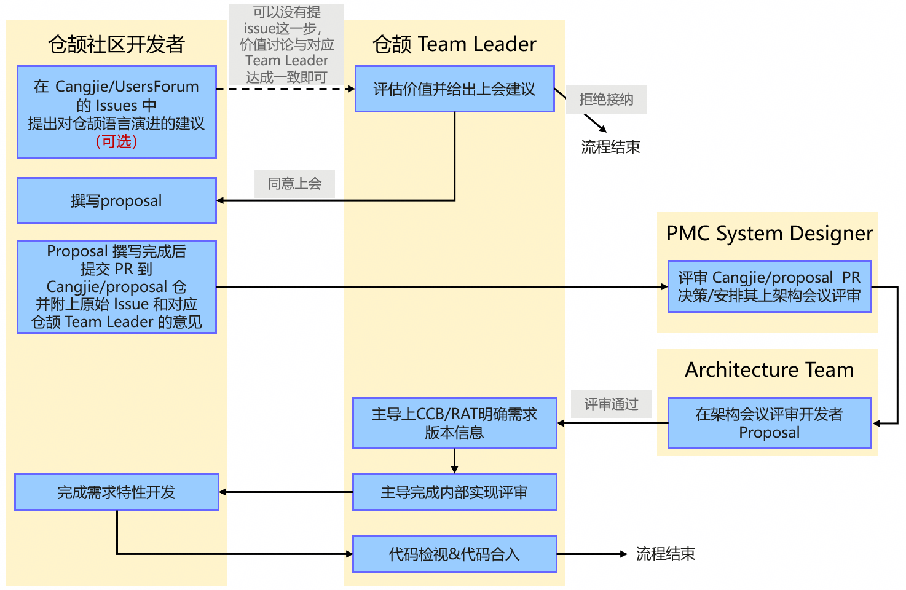
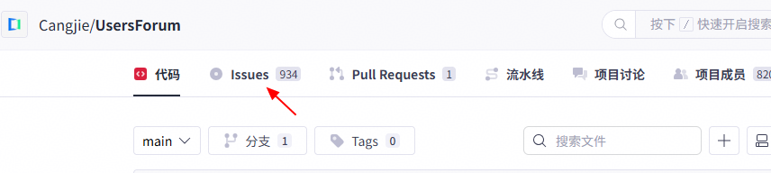
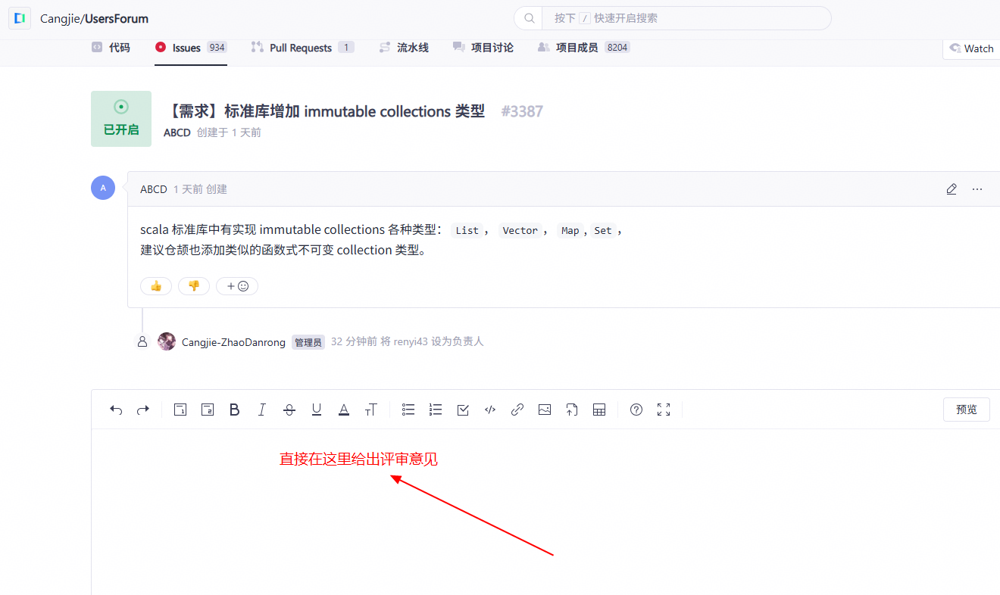

# 仓颉社区提案管理草案

本提供提出仓颉社区管理仓颉语言技术演进提案的办法 Cangjie Evolution and Enhancement Process（CJEEP），用于指导仓颉开发者和仓颉社区管理者公开提出、完善、评审、决策和跟踪仓颉语言关键能力演进。

# 1、何时会使用 CJEEP

对于仓颉社区开发者，可根据 CJEEP 的指导：
- 提出对仓颉语言特性演进的想法；
- 与仓颉相关领域Team交流自己的语言设计想法；
- 撰写仓颉语言特性的设计提案（proposal）；
- 上“仓颉架构评审会议”评审自己的提案。

对于仓颉社区管理者和仓颉相关领域Team，可根据 CJEEP 的指导：
- 获取仓颉社区开发者对仓颉语言特性演进的建议；
- 与社区开发者交流仓颉Team对其建议的看法；
- 评审仓颉社区开发者的设计提案（proposal）；
- 跟踪仓颉社区开发者提案的进展。

# 2、CJEEP 流程综述

简单来说，当仓颉社区开发者对仓颉语言特性演进有自己的想法时，可根据 CJEEP 的指导，通过如下流程，完成一整套提出想法、与仓颉相关领域专家交流、同意上架构会议评审、完成会议评审的流程。



根据上图的流程，我们知道：
- 社区提仓颉 Proposal 有两个入口：1) 从 Cangjie/UserForum 提 issue 开始，Team Leader 认可价值并觉得可以作为一个特性提案后，去 Cangjie/proposal 仓提 issue；2) 如果已经和 Team Leader 通过其它途径完成了需求价值的讨论，就无需从 Cangjie/UserForum 提 issue 开始，直接去 Cangjie/proposal 提需求即可。
- Team Leader 为提案的价值、可行性、设计质量负责，需要给出明确的同意/拒绝的建议。
- PMC System Designer 为最终的决策提案上会负责，负责将 Cangjie/proposal 仓的 PR 合入仓库，并安排上会。
- 对于通过了仓颉架构评审的 Proposal，后续开发交付流程由该议题对应的 Cangjie Team 作为第一责任人承接，包括：上CCB/RAT将需求落地正式版本和迭代（如果已经在版本内的需求就不需要了）、上实现评审完成实现方案评审、对设计开发者实现的代码做检视、代码合入。

# 3、角色和职责

| **角色** | **责任人** | **主要职责** |
| --- | --- | --- |
| 社区开发者 / CJEEP Author | / | 提交 UsersForum Issue；按要求编写和修订 CJEEP；回应评审；关联 prototype 和实现 |
| Team Leader | 各Team SE | 在 Issue 中判断范围和所属 Team；负责 Draft PR 初审；检查模板、兼容性和可行性；进行 Team reviewer |
| PMC System Designer | 版本SE（查君鹏） | 跨 Team 分流；维护流程和模板；安排并主持 Architecture Review；发布 Decision；以 Proposal Repository Committer 身份合入或归档 Proposal |
| Architecture Team | 仓颉架构会议评审人 | 正式评审 CJEEP；形成接受、附条件接受、退修或拒绝结论；记录理由 |
| Implementer / 相关仓库 Committer | / | 提交实现 Issue/PR、上CCB/RAT排迭代、上实现评审完成实现方案讨论、代码检视、测试和文档；更新实现状态 |
| QA、Test 和 Release Team | / | 完成测试、版本准入、发布和 release notes（遵循仓颉开发流程，本次 CJEEP 不重点体现） |

# 4、原始 Issue 提出环节

## 4.1、提交方式

提交平台：[Cangjie/UsersForum](https://gitcode.com/Cangjie/UsersForum) 仓的 Issue 下



## 4.2、相关主题

CJEEP 主要是提供仓颉设计开发者上“仓颉架构会议”的评审流程，因此其目标主题与上仓颉架构会议评审的特性/变更保持一致，包括：
1. 标准库、扩展库、互操作库公开 API 的签名、行为相关的重大用户可见变更；
2. 仓颉编程规范、开发规范相关的标准定制及变更（例如：异常信息规范、变量名大驼峰还是小驼峰）；
3. 仓颉语言编译器、运行时、包管理、构建、IDE、调试、工具链、工程模板等核心能力的用户可感知的重大界面变更；
4. 对仓颉核心能力逻辑架构视图、运行视图有重大修改的变更（例如：编译期中间语言IR变更、编译关键流程变更、运行时异常、线程管理策略的变更）；
5. 涉及函数签名、二进制、程序行为、工具链相关的兼容性变更；

仓颉语言重大Spec变更，其实现影响多模块、组件、后端、平台。
以下变更可以在 Cangjie/UsersForum 的 Issue 区提及并讨论，但不在 CJEEP 的后续流程中跟踪：
- 保持公开行为不变的 bug 修复、性能优化、内部重构和测试补充（属于实现评审）；
- 仓颉语言语法、语义、类型系统、名称解析、内存模型和语言规范变更（属于仓颉Spec评审）；
- Team System Designer 与相关 Committer 判断为局部、可逆的小改动；
- 文档文案、拼写、格式修正。

## 4.3、Issue 模板

直接使用 Cangjie/UserForum 提供的“需求”模板，在“需求分析”中可说明下：如果仓颉团队认可需求价值，作者可提供相关的设计提案，方便 Team Leader 明确后一步处理策略。
```
### 需求描述
<!-- 
请在这里描述您对我们的需求
-->
### 需求价值
<!-- 
请在这里描述您的需求的价值
-->
### 需求分析
<!-- 
请在这里描述您的需求在业界相关领域实现情况
-->
```

## 4.4、处理策略

由仓颉社区管理者，结合自身认知和 Issue 中的期望评审团队，将 Issue 分配给对应的 Team Leader 进行评审。

# 5、Team Leader 评审 Issue 环节

Team Leader 收到原始 Issue 后，经过与社区开发者讨论以及内部团队对齐后，决策是否进行下一环节，具体要求为：
1. 直接在原始 Issue 的评论区回复，给出评审结论。



2. 评审结论只有两个结果：
（1）同意提proposal + 理由：作为该提案可以进入下一环节的唯一核心留痕，该评价必须由对应 Team Leader 给出。
（2）拒绝 + 理由：只作为依据，表示该 Issue 已经处理，后续流程的相关责任人无须感知。

明确结论后，要求将 issue 关闭。

# 6、社区开发者提交 Proposal

当社区开发者收到 Team System Designer 的“同意进入下一环节”的答复后，就可以向 Cangjie/proposal 仓提交自己的提案。仓库 lisence CCBY 4.0。
注意：Cangjie/proposal 仓当前只归档架构会议的议题，仓颉团队内部和社区上会提案都统一归档到这里，不接受 Spec、功能实现、CCB 提案，这些提案目前先放在 Cangjie/wikiShare。

## 6.1、Cangjie/proposal 仓目录设计

```
Cangjie/proposal/
├── proposals/
|   ├── team_std/               # 归档std&stdx相关的提案
|   ├── team_compiler/          # 归档编译器相关的提案
|   ├── team_runtime/           # 归档运行时相关的提案
|   ├── team_tools/             # 归档工具链相关的提案
|   ├── team_ide/               # 归档IDE相关的提案
│   ├── team_interop/           # 归档互操作相关的提案
│   ├── team_macro/             # 归档宏相关的提案
│   ├── team_spec/              # 归档语言规范相关的提案
|   |---- team_ai_infra/
│   ├── security/               # 归档安全相关的提案
│   └── community/              # 归档社区管理相关的提案 
├── decisions/                   # 记录“架构会议”上的关键评审结论
|   ├── year1-month1-day1-review-conclusions
|   ├── year2-month2-day2-review-conclusions
│   ├── ...
│   └── decision-template.md  # 纪要模板
├── proposal list.md      # PMC System Designer 管理提案专用
├── 架构特性设计模板.md         # Proposal 提案模板
└── README.md                 # 代码仓说明，Proposal 提交要求和管理办法
```

注意：Cangjie/proposal 仓不仅归档仓颉社区开发者的提案，也归档仓颉团队内部的提案。
Cangjie/proposal 仓当前提交 PR 是放开的，但对于社区的 Proposal 提案，只有按照模板编写，并附上了 Cangjie/UserFrom 的 issue 链接，且 issue 中明确由 Team System Designer 同意提交 proposal 结论的 PR 才会处理，否则一律视为无效 PR 处理。

## 6.2、Proposal 模板

```
Proposal 模板地址：./架构特性设计模板.md 
```

- CJEEP ID：分配的 CJEEP 编号；
- Author(s)：作者名字；
- Status：评审状态，第一次提交 PR 时填 Reviewing；
- Implementation：特性对应实现的 PR 链接，未实现就填 UnImplemented。

CJEEP ID 由 PMC System Designer 统一分配，第一次提 PR 时 CJEEP ID 可先不填，PMC System Designer 后续会分配 CJEEP 编号并补充。
注意：如果是针对已有提案，提新的 PR 来修改，则继续沿用原始的 CJEEP 编号，不再新增 CJEEP 编号。

## 6.3、提交 Proposal 的方式

开发者按照 Proposal 模板撰写 Proposal 草稿完成后，按如下流程提交：
1. 向  Cangjie/proposal 仓提交 PR；
2. 提交 PR 的 commit 信息需要包含如下内容：
```
# Summery

对提交 PR 的一个概述，为啥提这个 PR，希望修改啥

# Source Issue

Cangjie/UserForum 的原始需求 Issue 的链接。
如果直接是从 Cangjie/proposal 仓提 PR 开始的就不用填写了。

# Authors

提案设计人

# Corresponding Team

提案相关 Team
```

# 7、PMC System Designer 管理 Proposal & 安排上会管理

PMC System Designer 负责审视 Cangjie/proposal PR，安排上会，跟踪 proposal 的状态。

## 7.1、审视 PR

PMC System Designer 负责需求合入，审视 PR 主要有4个关键动作：
1. 检查该 PR 是否有对应责任 Team Leader 给出的“Proposal检视通过”的评论，或者有原始 issue 并有 Team Leader 的“同意提 proposal”的结论；
2. 从版本能力规划和整体价值的角度，评估该 proposal 是否有价值，如果明确不同意接纳，则需要与相关 Team System Designer 达成一致，在 PR 的评论区回复 

 不同意上架构会议评审 + 理由
3. 检擦该 PR 是否有明显的问题，例如：是否有关键字段没有填写、是否提交归档的目标目录有问题，这些修改建议直接在 PR 的评论区回复；
4. 明确可以上会后，合并 PR，将 PR 信息记录在“Proposals 状态跟踪.md”，分配 CJEEP 编号，并在评论区答复 

 同意上架构会议评审，详细安排参见 --> 指向“Proposals 状态跟踪.md”文档 + Cangjie/community 仓架构会议日程安排
注意：为方便评审和溯源，所有同意上会的 PR 都会合并入仓，不管其最后是否被接受，合入 PR 即代表在仓颉架构评审会报议题成功。
注意：Cangjie/UserForm 的 Issue 和 CJEEP 的编译是一一对应的，方案修改，重新提交一个 Proposal 文档继续沿用之前的 CJEEP 编号。

## 7.2、跟踪 proposal 状态

在 Cangjie/proposal 仓的“proposals 状态跟踪.md”文档中管理所有 Proposal 的状态，该文档的内容是一个表格，表头设计如下：

| Title | CJEEP Number | Author(s) | Corresponding Team | (Original) Issue | Status | Schedule Time | (Latest) Proposal | Decisions |
| --- | --- | --- | --- | --- | --- | --- | --- | --- |

字段解读：
- Title：提案标题
- CJEEP Number：编号从 CJEEP-0000 开始递增，只起个方便索引和查找的作用
- Author(s)：提案作者
- Corresponding Team：提案对应的相关 Team
- (Original) Issue：Proposal 对应的原始 Cangjie/proposal 中的 Issue 链接，只起跟踪作用
- Status：提案状态，只有三个状态：
  - Reviewing：表示“评审中”，草稿撰写、等待上会、会议意见闭环中这些场景都属于 Reviewing；
  - Accepted：提案接受。上会评审通过；
  - Rejected：提案被拒绝。上会已经明确不会接受该提案。
- Schedule Time：上会时间。注意：一个议题可以多次上会，每次上会讨论的时间都会被记录在这个单元（自上而下，时间由近及远）。
- (Latest) Proposal：最新提案的链接（一个提案开发者可能多次修改，为不覆盖历史版本会新建文档，这里只归档最新的提案）。
- Decisions：对应到 Cangjie/proposal/decisions 目录下，该提案对应评审结论所在文档。因为可能涉及多次上会讨论，每次纪要对应的链接都要归档在该单元格（自上而下，时间由近及远）。

注意：Proposal 提案中的基本信息的更新需要由提案人/相关 Team 负责，PMC System Designer 不负责提 PR 更新。

# 8、Architecture Team 正式评审与会议通知

## 8.1、会议通知

会议通知更新在：[https://gitcode.com/Cangjie/community/blob/main/team/team_architecture/meetings-arch/meeting-notices.md](https://gitcode.com/Cangjie/community/blob/main/team/team_architecture/meetings-arch/meeting-notices.md)，该文档同样是一个表格，表头设计如下：

| **序号** | **会议链接** | **会议日期** | **议题名称** | **时长(分钟)** | **汇报人(姓名+邮箱)** | **参与人(姓名+邮箱)** |
| --- | --- | --- | --- | --- | --- | --- |

## 8.2、评审&会议纪要归档

Architecture Team 是 CJEEP 的最高且最终技术决策组织，由该组织在“仓颉架构评审”会议上决策提案是否接纳。
会议纪要归档在 Cangjie/proposal/decisions 目录下，文件格式为：日期-review-decision
year-month-day-review-decision.md
纪要格式为：
```
# CJEEP-xxxx

编号

## Title

议题标题

## Proposal

Proposal 链接

## Summary

会议内容概述

## Conclusion

会议关键结论

## Remaining Issues

遗留问题

<-------------- 其它议题结论 -------------->
```

注意：Cangjie Team 内的架构会议评审纪要不在此归档，还是走 WeMeeting 管理。

## 8.3、遗留问题闭环

遗留问题统一由 PMC System Designer 录入 Cangjie/proposal 仓的 Issue 模块。针对 Cangjie/proposal 仓的 issue，团队统计 issue 闭环情况时只统计 PMC System Designer 提的 issue。

# 9、开发和发布

Proposal 在架构会议评审通过后，相关 Team 为后续的代码开发、落入版本负责，遵守仓颉语言标准开发流程。具体工作如下：
1. 上 CCB/RAT，将需求落入正式 Cangjie 版本迭代；
2. 根据 CCB/RAT 结论，录入需求，如果实际是非仓颉团队的同事开发，可在工作量中刨去非仓颉团队的工作量（目的是方便团队内部统计人力管道）；
3. 上实现评审，完成实现方案讨论（实现评审不是外部会议，需要由 Team 内同事完成）；
4. 完成代码检视、测试；
5. 合入代码。


