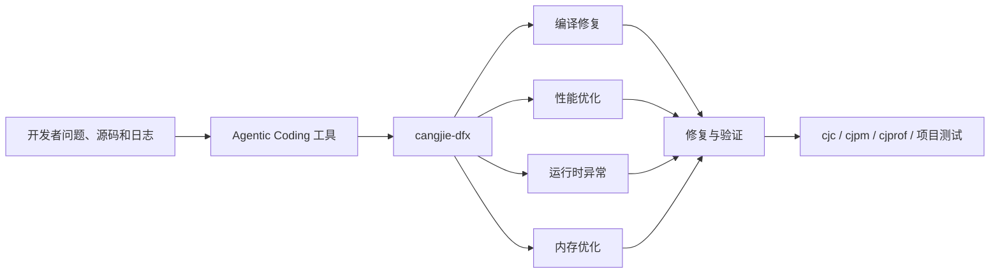
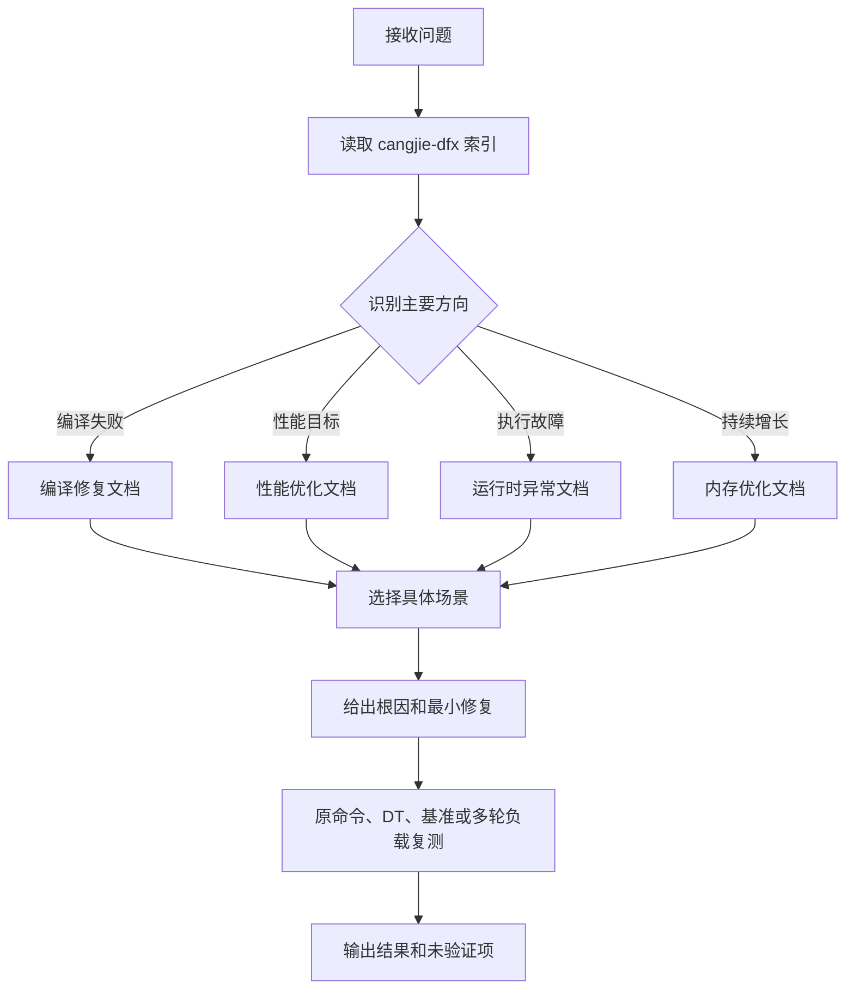

# 仓颉 DFX 场景处理 Skill 架构设计

## 1、特性需求/问题/动机的来源与价值

### 1.1 需求来源

本特性来自「仓颉开源社区学习赛」高级任务：

> 新增典型 DFX 场景（编译修复、性能优化、异常、内存优化）处理 Skill。针对新兴的编程语言仓颉，在使能 Agentic Coding 的过程中，仍存在不少场景需要借助 Skills 来使大模型更好地生成代码并进行优化，有且不限于典型报错的修复建议、高性能编码写法、运行时异常的修复以及内存的优化等，期望通过构建更多场景化解决方案 Skills 来增强仓颉的 Agentic Coding 开发能力，提交代码至 CangjieSkills。

目标实现仓库为 [`Cangjie-SIG/CangjieSkills`](https://atomgit.com/Cangjie-SIG/CangjieSkills)。

### 1.2 问题与价值

通用大模型处理仓颉工程时，容易混用其他语言的语法、API、异常模型和构建参数；在性能和内存问题中，也容易脱离基线或证据直接给出结论。

本特性通过仓颉场景化知识，帮助 Agent 完成以下工作：

1. 根据 `cjc`、`cjpm` 的编译信息定位和修复典型错误。
2. 根据仓颉语言和标准库特性给出高性能编码方式。
3. 根据异常、调用栈和触发输入定位运行时问题。
4. 根据仓颉堆、RSS、对象持有和资源生命周期分析内存问题。
5. 修复后通过原始命令、DT、基准或多轮负载进行验证。

### 1.3 用户体验

| 实现前 | 实现后 |
| --- | --- |
| Agent 可能根据级联错误或其他语言经验直接修改代码 | Agent 从首个根因开始，按照仓颉语义给出最小修复 |
| 给出性能建议但没有可比基线 | 固定 SDK、构建配置、输入和测量方法后再比较 |
| 通过宽泛捕获隐藏运行时异常 | 保留异常类型、上下文和正常/失败路径语义 |
| 将 RSS 上升直接判断为内存泄漏 | 区分仓颉堆、原生内存、句柄、缓存和高水位 |

## 2、特性影响分析

### 2.1 系统位置

`cangjie-dfx` 位于 Agentic Coding 工具与仓颉项目之间的知识指导层，不进入仓颉程序的编译产物或运行路径。



### 2.2 文件和模块影响

拟在 `CangjieSkills` 中新增：

```text
.agents/skills/cangjie-dfx/
├── SKILL.md
├── compile_errors/README.md
├── performance/README.md
├── runtime_exceptions/README.md
└── memory/README.md
```

实现只新增以上 5 个 Markdown 文件，不修改现有 Skill。

### 2.3 环境和依赖

Skill 本身不依赖特定 target、后端或操作系统。文档指导的编译、测试、基准和诊断命令依赖用户当前 SDK 和平台：

1. `cjc`、`cjpm` 命令以当前 SDK 的实际输出和子命令帮助为准。
2. `cjprof` 仅支持 Linux；其他平台使用可用的系统采样器或项目计数证据。
3. CFFI 场景需要同时核对 C 头文件、目标架构、ABI 和动态库。
4. 性能比较必须使用相同 SDK、机器、构建配置、输入和并发度。

### 2.4 兼容性和外部影响

本特性不修改仓颉语言、编译器、运行时、标准库或工具链的 API/ABI，不改变用户项目的构建和运行行为。

支持 `.agents/skills` 的 Agentic Coding 工具可以发现并加载该 Skill；不支持该规范的工具不受影响。删除新增目录即可回退。

### 2.5 性能影响

Skill 不进入用户程序运行路径，对仓颉产物没有直接性能影响。

主要开销是 Agent 上下文。设计使用精简的 `SKILL.md` 作为一级索引，只按当前问题读取一个方向文档，避免一次加载全部内容。

## 4、本特性的设计/实现方案

### 4.1 总体流程



### 4.2 入口设计

`SKILL.md` 包含标准 frontmatter 和四个方向的相对链接：

```yaml
---
name: cangjie-dfx
description: "提供仓颉语言 Agentic Coding 典型 DFX 场景处理文档……"
---
```

入口只负责发现和索引，不重复具体场景内容。

### 4.3 场景划分

| 方向 | 主要内容 |
| --- | --- |
| 编译修复 | 类型与 Option、包与导入、宏、CFFI、语法、函数、类型系统、模式匹配、`cjpm` 构建 |
| 性能优化 | 复杂度、集合、字符串、分配、Lambda、缓存、并发、I/O、CFFI、数据表示 |
| 运行时异常 | Option、输入契约、集合边界、异常传播、Future、并发、Resource、原生故障 |
| 内存优化 | 堆与 RSS、临时对象、容器、缓存、长期引用、回调、句柄、原生内存 |

每个具体场景按以下结构编写：

1. 常见表现。
2. 错误或低效代码。
3. 问题说明。
4. 修正代码。
5. 修复与验证。

### 4.4 处理原则

1. 编译问题从首个根因诊断开始，修复后重跑原始命令。
2. 性能问题先建立可比基线，再修改热点或复杂度问题。
3. 运行时异常保留异常类型、上下文和触发输入，并验证正常与失败路径。
4. 内存问题区分仓颉堆、RSS、原生内存和系统资源，并通过多轮负载验证稳态。
5. 场景未直接命中时，根据当前证据选择最接近的方向，不强套已有案例。

## 5、DFX 分析

| 维度 | 设计措施 |
| --- | --- |
| 可靠性 | 编译重跑原命令；性能使用可比基线；异常验证正常与失败路径；内存使用多轮和多类证据 |
| 可维护性 | 入口和四个方向独立，新增场景放入对应问题族，避免重复维护 |
| 可用性 | description 覆盖四类常用问题，入口提供中文索引，工具不可用时说明降级方式 |
| 可测试性 | 静态检查链接和 frontmatter，并通过 SDK 示例与 Agent 黑盒用例验证 |
| 性能 | 按需读取一个方向文档，减少无关上下文 |

## 6、可信分析

| 维度 | 风险和措施 |
| --- | --- |
| 安全性 Security | 不通过删除测试、屏蔽诊断或执行来源不明命令完成修复 |
| 可靠性 Reliability | 所有结论关联原始命令、输入、基线或资源证据 |
| 韧性 Resilience | SDK、target 或工具不可用时保留未验证项，不用其他平台结果替代 |
| 可用性 Availability | 优先运行最小相关构建、测试和有界负载 |
| 隐私 Privacy | 日志、路径和堆快照需要脱敏，不上传凭据或私有源码 |
| 无害 Safety | 采用最小修复，并验证业务语义、资源所有权和目标 ABI |

## 7、关键 DT 用例简述

| 测试用例名称 | 预置条件 | 用例关键步骤 | 预期结果 |
| --- | --- | --- | --- |
| Skill 结构与按需加载 | 5 个候选文件；四类单一问题 | 检查 frontmatter、相对链接，并记录 Agent 读取文件 | Skill 可发现，链接完整，只读取对应方向文档 |
| 编译修复 | 当前仓颉 SDK；准备典型编译错误 | 复现、使用 Skill 修复、重编译 | 定位首个根因，原命令通过 |
| 性能优化 | 固定 SDK、构建配置、输入和测量方法 | 使用 Skill 优化，校验语义并复测 | 输出可比数据，不承诺固定提升 |
| 运行时异常 | 固定输入触发异常或资源失败路径 | 保存异常和输入，修复并执行相关测试 | 正常、失败和边界路径符合预期 |
| 内存优化 | 相同多轮负载下对象或资源持续增长 | 记录业务计数、堆、RSS 或资源证据，修复后复测 | 说明内存类别，状态达到有界稳态 |

具体仓颉代码以当前 SDK 的实际编译、运行、测试或基准结果为准。

## 8、结论

本方案在 `CangjieSkills` 中新增 `cangjie-dfx`，采用一个精简入口和四个方向文档，为仓颉编译修复、性能优化、运行时异常和内存优化提供场景化知识。

方案不修改仓颉 API/ABI，不进入用户程序运行路径。待 Team 评审确认 Skill 名称、四类场景边界和文件结构。


## 附录：评审范围

本特性不修改编译或执行 pipeline，不涉及标准库 API，建议由 CangjieSkills 对应 Team 完成功能和知识准确性评审。
