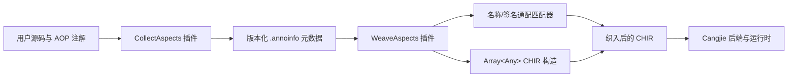
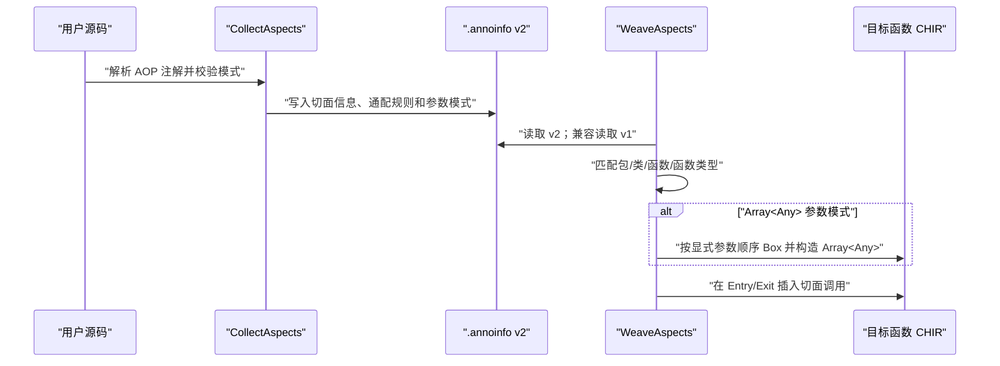

# stdx.aspect_cj 切点通配符与切点参数实参设计

* CJEEP ID：CJEEP-0002
* Author(s)：ShenZi
* Status：Reviewing
* Implementation：UnImplemented

关联 Issue（需求来源）：[Cangjie/UsersForum#2248](https://atomgit.com/Cangjie/UsersForum/issues/2248)

# 1、特性需求/问题/动机的来源与价值

`stdx.aspect_cj` 当前按包名、类名、函数名和函数类型做精确匹配；切面函数若要接收切点参数，形参必须与每个目标函数逐项一致。因此，同一类横切逻辑需要重复声明多条注解或多个切面函数，无法方便地覆盖一组命名或签名相近的函数。

需求讨论进一步明确了一个使用约束：织入过程应当对切点函数开发者无感知，不要求目标函数或目标类型额外添加 AOP 专用宏、标记注解、代理包装或胶水代码。本方案因此继续增强现有 `stdx.aspect_cj` 编译器插件，在切面侧完成配置和声明，在 CHIR 阶段完成匹配与织入，目标业务源码保持不变。

本特性提供两项能力：

1. 切点配置支持确定性的通配符匹配：名称段内 `*` 匹配零个或多个字符；包名及函数类型限定类型名中的整段 `**` 匹配零个或多个名称段；函数类型中的独立 `*` 匹配一个类型，参数列表中的独立 `**` 匹配零个或多个参数。
2. `InsertAtEntry`、`InsertAtExit` 切面函数可声明一个 `Array<Any>` 参数，运行时获得目标函数全部显式实参的只读值快照，从而用同一个切面覆盖不同参数列表的目标函数。

实现前，开发者需要为 `handleOrder(OrderDAO)` 和 `handlePriorityOrder(Int64, OrderDAO)` 分别声明切面；实现后可用 `packageName: "p.**.service"`、`className: "Order*"`、`methodName: "handle*"`、`funcTypeStr: "(**,p.*.a.**.*DAO)->*"` 和一个 `Array<Any>` 切面同时匹配二者。

# 2、特性影响分析

- 影响仓库：`Cangjie/cangjie_stdx` 与 `Cangjie/cangjie_test`。
- 影响模块：`cangjie_stdx/src/stdx/aspect_cj/aspect_cj.cj`、`cangjie_stdx/src/stdx/aspect_cj/plugins/collect_aspects/collect_aspects.cj`、`cangjie_stdx/src/stdx/aspect_cj/plugins/weave_aspects/weave_aspects.cj`，以及 `cangjie_test/testsuites/LLT/compiler/Plugins/AOP_tests/linux` 下的 AOP 用例；不改变编译器公开命令行接口。
- 环境依赖：实现位于 CHIR 插件层，原则上不绑定具体 OS；首批 DT 以 Linux x86_64 cjnative 为准，其他已支持 target 复用同一 CHIR 逻辑。
- API/ABI：不修改三个注解类的构造参数；旧的精确配置继续可用。`.annoinfo` 是构建中间产物，新写入格式增加版本头和参数模式位；读取端兼容无版本头的旧格式，对未知版本明确报错。
- 外部感知：仅使用通配符或 `Array<Any>` 模式的用户感知新行为。
- 性能：单名称匹配的时间复杂度为 `O(P×N)`，包名和函数参数序列匹配分别为 `O(S×T)`；空间使用滚动数组，为目标序列长度的 `O(N)`。不使用递归回溯，避免指数级最坏情况。

# 3、业界竞品分析（可选）

AspectJ 的 pointcut 支持名称模式、参数模式、注解匹配和逻辑组合，是本需求的主要使用体验参考。本方案不照搬完整的 AspectJ pointcut 表达式语言，仅扩展现有字符串字段，交付活动任务明确列出的通配符与实参传递。Issue 第 3、4 项提出的注解切点及规则 AND/OR/NOT 是必要的后续演进方向，但其公开接口、匹配对象和组合语法须单独完成详细设计并通过 Team 评审，不属于本 Proposal 的实现与验收范围。

需求讨论给出的 [`Cangjie-SIG/fountain/f_aspect`](https://gitcode.com/Cangjie-SIG/fountain/tree/master/f_aspect) 参考实现采用宏改写与运行时路由：目标函数经 `Pointcut`/`WeavedBean` 宏包装后，以 `Array<Any>` 调用切面链，能够提供参数替换、around、throwing/final、注解规则和 AND/OR/NOT 等更完整的 AOP 生命周期。该实现可作为参数模式和规则能力的语义参考；受其第三方工具库交付方式影响，它选择让目标源码参与宏改写，并使用反射、路由缓存和运行时依赖。`stdx.aspect_cj` 已有 CHIR 插件，无需为获得这些规则能力改用宏；本方案继续在编译期收集、匹配和织入，保持切点开发者无感知。

## 3.1 需求范围对照

| 需求来源 | 能力 | 本 Proposal 处理方式 |
|---|---|---|
| 活动高级任务标题、Issue 第 1 项 | 包名、类名、函数名及函数类型通配配置 | 本次设计并实现 |
| 活动高级任务标题、Issue 第 2 项 | 切面通过 `Array<Any>` 使用切点函数实参 | 本次设计并实现；初版为不回写的浅快照 |
| Issue 第 3 项 | 注解切点 | 必要的后续特性；另行完成详细设计和 Proposal 评审 |
| Issue 第 4 项 | 规则与切面分离、AND/OR/NOT | 必要的后续特性；另行完成详细设计和 Proposal 评审 |
| Issue 价值描述 | 从切面修改目标函数实参 | 涉及类型安全、拆箱失败和部分写回，待 Team 确认后另行设计 |

上述拆分不否定 Issue 后三项需求；目的是使本次活动题目明确列出的两项能力先形成可兼容、可验收的最小闭环。后续 Proposal 应优先评估复用现有 Collect/Weave 插件的编译期规则模型，不在本次设计中提前固化公开 API 和表达语法。

# 4、本特性的设计/实现方案

## 4.1 总体流程

无感知织入边界如下：

- 目标函数和目标类型不要求新增 AOP 专用宏、标记注解、代理接口或包装函数；原有源码可直接作为切点。
- 切面开发者仅在现有 `InsertAtEntry`/`InsertAtExit` 注解配置中使用通配符，并可选择 `Array<Any>` 参数模式。
- 匹配、实参装箱和调用插入全部由 Collect/Weave 插件在编译期完成，不新增运行时路由或服务定位依赖。
- 未使用新语法的旧精确配置保持原行为，已有目标源码不需要迁移。

## 4.2 通配符语义

| 配置位置 | 语法 | 语义 |
|---|---|---|
| 包名、类名、函数名的名称段 | `*` | 同一段内匹配零个或多个字符，不跨 `.` |
| 包名完整段 | `**` | 匹配零个或多个包名段 |
| 函数参数或返回类型 | 独立 `*` | 匹配一个任意类型 |
| 函数参数列表 | 独立 `**` | 匹配零个或多个参数，初版最多出现一次 |
| 函数类型中的限定类型名 | 如 `p.*.a.**.*DAO` | 名称段内 `*` 与完整段 `**` 的语义同包名匹配 |

函数类型解析对圆括号、方括号和泛型尖括号做嵌套计数，只有顶层逗号才分隔参数。无通配符配置保持精确匹配；`std.core.T` 与 CHIR 对内建类型使用的简写 `T` 视为等价。

## 4.3 `Array<Any>` 实参模式

- 仅当 Insert 切面函数有且仅有一个显式 `Array<Any>` 参数时启用。
- 数组元素按目标函数源码显式形参顺序生成；实例方法隐式 `this` 不进入数组。
- 每个值通过 CHIR `Box` 转为 `Any`，写入 `RawArray<Any>`，再调用 `Array<Any>` 的底层构造函数。
- `InsertAtEntry` 与 `InsertAtExit` 都支持该模式。Exit 复用入口处构造的 `Array<Any>`，其语义是“入口时刻的参数值/引用浅快照”：值类型元素保留入口值，引用类型元素保留入口时指向对象的引用，不复制对象状态。
- 因此，目标函数执行期间若修改引用对象的内容，Exit 通过该引用看到修改后的对象；若目标函数仅把自己的形参重新绑定到另一对象，Exit 仍持有入口时的原对象引用。
- 初版 `InsertAtExit` 保持现有语义，仅在目标函数正常退出路径执行；异常抛出/传播路径不在本特性范围内。
- 初版为只读参数快照：修改数组元素不会回写目标函数参数，也不承诺保存引用对象的入口状态。
- 实例切面原有的 `this` 传递规则保持不变。
- 实例成员切面函数的 `this` 类型静态确定，因此其 `packageName`、`className` 仍须精确配置。全局/静态切面可以使用接收者通配符；若以类型化形参接收目标实例的 `this`，仍须通过原有的精确类型校验。`Array<Any>` 模式不包含 `this`。
- `ReplaceFuncBody` 继续使用最后一个“原函数闭包”参数，不在本次增加 `Array<Any>` 模式，等待 Team 在本 Proposal PR 中确认。

通配函数类型只允许与 `Array<Any>` 参数模式组合，避免一个切面函数的静态形参无法适配多个目标签名。

## 4.4 元数据发现与兼容

元数据文件使用“切面来源包 + 目标索引”命名，避免多个切面包写入同一文件。精确包名以目标包作为索引；包含包名通配符的规则使用固定哨兵索引 `__aspect_cj_wildcard__`。织入阶段发现当前目录内的 AOP 元数据，解析后再执行实际包名匹配。

新格式首行写入 `#aspect_cj_annoinfo_v2`，每条 Insert 记录增加 `usesPointcutArgsArray`。读取逻辑：

1. v2：按新字段读取；
2. 无版本头：按 v1 读取，并将新字段默认为 `false`；
3. 未知版本或损坏记录：输出明确诊断并停止使用该文件。

## 4.5 方案选择

- 选择动态规划 glob，而非正则表达式：无需引入转义规则和额外依赖，复杂度确定。
- 选择版本化文本元数据，而非直接替换为新序列化协议：变更小、可兼容已有构建中间产物。
- 选择 `Array<Any>` 快照，而非参数回写：Entry/Exit 语义一致，不引入拆箱失败、数组长度不一致和部分写回问题。
- 选择增强现有 CHIR 插件，而非宏改写或运行时代理：目标源码无需添加切点标记或胶水代码，保持织入对切点开发者无感知，并避免新增反射与运行时路由依赖。

## 4.6 后续演进约束（非本次实现与验收范围）

为避免本次实现阻碍 Issue 第 3、4 项的后续演进，当前方案保留以下架构约束：

1. 当前 `packageName`、`className`、`methodName`、`funcTypeStr` 四个字段保持 AND 语义，其元数据表示应允许后续归一化为基础执行规则。
2. 后续注解规则和逻辑组合应优先在 Collect/Weave 插件内完成编译期解析与求值，匹配结果仍由 Weave 插件直接修改 CHIR，不因扩展规则能力而引入宏、反射或运行时路由。

后续详细设计应评估以下事项：

- 规则是否独立命名并被多个 Entry/Exit/Replace 切面引用，以及如何避免重复配置。
- AND/OR/NOT 的表达形式、优先级、括号与短路语义。
- 注解切点覆盖目标类型、目标函数还是形参，以及是否匹配注解子类型和元注解。
- 现有六字段注解配置的兼容与演进策略，保证旧代码在兼容期内不改变语义。
- 新规则的元数据版本、未知操作符和循环引用诊断。
- CHIR API 是否能稳定取得上述目标注解信息；开发前须用最小原型验证，不能仅依据 `f_aspect` 的反射实现推定可行。

后续特性仍须独立给出用户接口、兼容性分析和 DT 验收表；本节仅记录演进方向，不视为相应能力已经完成架构评审。

# 5、DFX 分析

- 可诊断性：收集阶段拒绝非法包名模式、格式错误的函数类型、多个参数 `**`、未采用 `Array<Any>` 的通配签名切面，以及接收者类型不安全的实例切面通配配置。
- 可维护性：名称、包名、函数类型匹配集中在独立匹配器；元数据版本常量集中定义。
- 可观测性：未知元数据版本、文件损坏和 CHIR 必需定义缺失均输出带文件或函数名的错误。
- 性能与容量：滚动数组限制临时空间；通配元数据读取后应在单次插件运行内复用解析结果。

# 6、可信分析

- Security/Privacy：不新增外部 I/O 或数据上报；`Array<Any>` 仅包含当前调用已有参数。
- Reliability：确定性匹配算法、元数据版本校验和负例诊断降低静默误织入风险。
- Resilience：兼容 v1 元数据；未知版本采用显式失败而非按错误字段继续织入。
- Availability：精确匹配旧路径保留，不使用新能力的项目行为不变。
- Safety：通配符可能扩大织入范围，收集阶段语法约束和 DT 覆盖用于控制风险。

# 7、关键 DT 用例简述

| 测试用例名称 | 预置条件 | 用例关键步骤 | 预期结果 |
|---|---|---|---|
| `wildcard_pointcut_configuration` | Linux cjnative，加载两个 AOP 插件 | 使用 `def*`、`*`、`print*` 匹配两个函数 | 两个函数入口均执行切面 |
| `function_type_wildcard_configuration` | 同上 | 用 `(**,std.core.String)->*` 匹配一参和二参函数 | 两个目标均命中 |
| `wildcard_qualified_type_and_pointcut_args` | 同上 | 用 `p.**.service`、`Order*`、`handle*`、`(**,p.*.a.**.*DAO)->*` 匹配成员函数 | 一参、二参目标均命中，数组排除隐式 `this` |
| `wildcard_qualified_type_and_pointcut_args` 的无感知织入路径 | 同上 | 目标类型和目标函数不添加 AOP 专用宏、标记注解或代理包装，仅由切面侧配置规则 | 编译期正常织入，目标业务源码无需修改 |
| `wildcard_double_star_zero_segment` | 同上 | 用 `p.**.service` 匹配 `p.service` | `**` 正确匹配零个名称段 |
| `wildcard_qualified_type_and_pointcut_args` 的反匹配路径 | 同上 | 同时配置 `p.*.service` 尝试匹配 `p.shop.a.service` | `*` 不跨名称段，不发生过匹配 |
| `insertAtEntry_with_pointcut_args_array` | 同上 | 目标传入 Int64、String、Bool | 数组长度、顺序、值和动态类型正确 |
| `insertAtExit_with_pointcut_args_array` | 同上 | Exit 切面接收 Int64、String 实参快照 | 目标先执行，Exit 数组长度、顺序、值和动态类型正确 |
| `insertAtExit_with_mutated_reference_arg` | 同上 | 目标函数修改引用类型实参的对象内容，Exit 再读取入口时保存的引用 | Exit 看到修改后的对象内容，验证参数数组采用引用浅快照而非对象深快照 |
| `pointcut_args_array_no_writeback` | 同上 | Entry 切面修改收到的数组元素后调用目标函数 | 目标函数仍收到原实参，数组修改不回写 |
| `insertAtExit_multiple_normal_returns` | 同上 | 分别走目标函数的两个正常返回分支 | 两条正常退出路径均执行一次 Exit 切面 |
| `exact_higher_order_function_type` | 同上 | 使用旧式精确高阶函数签名 `((Int64)->Unit)->Unit` | 配置合法并正确织入，箭头不被误判为泛型结束符 |
| `pointcut_args_array_empty` | 同上 | 零参数目标使用 `Array<Any>` 模式 | Entry 收到长度为 0 的数组，目标正常执行 |
| `invalid_function_type_wildcard` | 同上 | 配置两个参数 `**` | 收集阶段拒绝并输出指定诊断 |
| `wildcard_function_type_requires_args_array` | 同上 | 通配签名切面不声明 `Array<Any>` | 收集阶段拒绝 |
| `instance_advice_receiver_wildcard` | 同上 | 实例成员切面用通配包名或类名扩大 `this` 类型范围 | 收集阶段拒绝并提示改用全局/静态切面 |
| 旧 Insert/Exit/Replace 回归 | 同上 | 运行原有入口、出口、替换用例 | 输出与变更前一致 |
| v1 元数据兼容 | 构造旧格式 `.annoinfo` | 使用新 Weave 插件读取 | 按精确规则正常织入 |
| 未知/损坏元数据 | 构造未知头或缺字段记录 | 编译目标包 | 输出诊断，不静默误织入 |

# 8、结论

当前为评审草案。本 Proposal 的实现与验收范围是通配符和切点实参；注解切点、规则复用和 AND/OR/NOT 是 Issue 已提出且需要后续完成的能力。待 Team 确认以下事项后更新结论：

1. `*`/`**` 语义与参数列表最多一个 `**` 的约束；
2. `Array<Any>` 排除隐式 `this` 且采用不回写的快照语义；
3. `Array<Any>` 初版覆盖 Entry/Exit，Replace 延后；
4. 本次活动先以通配符和切点实参形成验收闭环；注解切点、命名规则和 AND/OR/NOT 不从 Issue 删除，但须另行完成详细设计和 Proposal 评审；
5. 后续规则能力原则上延续 CHIR 插件无感知织入，实际可行性和公开 API 由后续评审确认。

评审结论：待评审。
遗留问题责任人：提案作者与对应 Team；闭环时间随 Proposal PR 评审意见确定。

# 附录

## 一、可测试性设计

正向用例覆盖名称、包名、函数类型通配与不同数量/类型参数装箱；负向用例覆盖语法约束和静态参数模式约束；回归用例覆盖原有 Entry、Exit、Replace；元数据用例覆盖 v1、v2、未知版本和损坏记录。

## 二、评审范围

本特性改变编译期 AOP 收集/织入流程并影响外部开发者配置语义，建议按功能实现评审或 Team 指定的架构评审方式执行。
