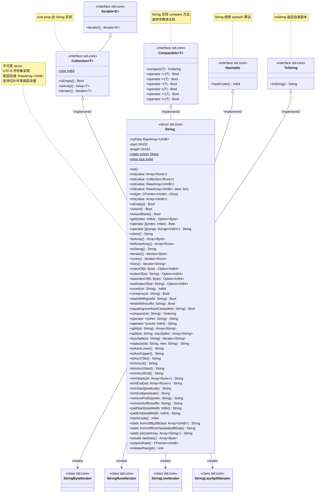
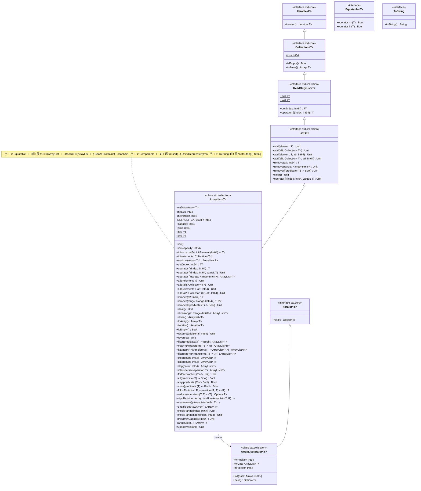

# 标准库适配 local mode 整体策略及部分接口适配方案

- CJEEP ID：CJEEP-004
- Author(s)：Zha Junpeng
- Status：Reviewing
- Implementation：UnImplemented

## 1、特性需求/问题/动机的来源与价值

仓颉语言引入 local mode 特性，与函数调用绑定的栈式内存区域，实现不依赖 GC 的对象分配和回收，目的是为了提升仓颉程序垃圾回收效率，降低 GC 的负载压力。

使用 local mode 特性依赖仓颉开发者在编码阶段，对需要使用 local mode 特性的仓颉变量声明做显示的标注，因此仓颉标准库（包括扩展库）如果希望为开发者提供支持 local mode 特性的标准库接口，需要新增或修改当前的标准库定义。

本提案希望针对标准库适配仓颉 local mode 特性：
1. 给出标准库、扩展库整体的适配策略，包括：
    (1) 哪些类和方法明确不适配 local mode；
    (2) 对接口从功能维度做划分，针对不同类型的接口提供对应的 local mode 适配方案。
2. 基于 1 提供的适配策略，给出 `Array`、`ArrayList`、`String` 类型的适配方案。

> 最终优先考虑适配扩展库 Json 解析相关的接口，支撑在美团众包场景验证 local mode 效果。

## 2、特性影响分析

1. 描述该特性在整个系统中的位置及周边接口

> 除了明确不适配 local mode 特性的标准库、扩展库接口，其余所有接口都需要针对 local mode 特性提供适配方案，首批 2026 年将优先适配 Json 解析涉及到的接口。

2. 环境依赖：包括是否涉及多 target、多后端、多 OS

> 与仓颉 local mode 特性支持的目标平台、后段、系统版本保持一致。

3. 其涉及的模块或服务，及其依赖关系。描述该特性有哪些关键约束或特性冲突。是否已提前沟通？

> 无

4. 前后版本是否兼容（特别是 ABI/API）

> 确保不影响标准库、扩展库已有的接口。

5. 外部用户是否感知

> 新增接口，外部开发者可感知。

6. 分析性能影响（空间/时间）

> - 空间：
>   + 包体积：涉及新增接口，标准库和扩展库编译产物的体积会增大。并且新增接口数量巨大，方法数量会翻倍，部分方法数量 x 3。
>   + 内存：编译产物增大导致的运行内存增大。
> - 时间：对当前已有接口，确保其执行性能不受影响。

## 3、背景知识

我们对仓颉 local mode 特性做一个简单的介绍。

我们使用 `T @ m` 表示仓颉类型 `T` 使用模式 `m` 修饰，其中模式 `m` 的可选取值为：
- `local!`
- `~local`
- `local?`

`T @ m` 即为仓颉 local region 的语法。

- `x: T @ local!`：表示变量 `x` 无法逃逸出当前函数，即：local region 类型实例。
- `x: T @ ~local`：当时变量 `x` 可以自由逃逸出当前函数，即：non-local region 类型实例。
- `x: T @ local?`：当前变量 `x` 可以是 `@ local!` 修饰的类型，也可以是 `@ ~local` 修饰的类型。

如下是一个代码示例：

```cangjie
// 参数 x 对于函数 f 是 internal 的 local-region 对象
func f(x: T @ local!): T @local! {
    let y: T @ local! = ... // y 对于函数 f 是 internal 的 local-region 对象

    if (cond) {
        return x // 返回值需要在上一层 region 存货，所以返回值必须对于函数 f 是 external 的 local-region 对象
    }

    // 通过 exclave 关闭当前 region，返回上一层 region，程序的控制流也会发生变化，类似与 return
    exclave {
        // 此时不能访问变量 y，因为变量 y 是 internal 的 local-region 对象，此时它的生命周期已经结束
        // 变量 x 因为对于函数 f 是 external 的 local-region 对象，依然可以使用
        use(x)
        let z: T@local! = ... // z 对于上一层 region（可以理解为函数 f 的调用者）是 internal 的
        return z  // 离开 exclave，exclave 里面的 internal 对于 f 而言是 external 
    }
    // exclave 后的表达式不会执行，exclave 有类似 return 的控制流转移效果
}
```

## 4、详细设计

### 4.1、明确标准库和扩展库适配 local mode 特性的范围

针对 local mode 特性的特点，我们明确如下类型的标准库、扩展库接口不考虑适配 local mode 的方案

| 接口类型 | 不适配原因 | 示例 |
| -------|----- | ---- |
| 多线程共享场景使用的接口 | 使用场景与 local mode 特性相违背 | `std.sync.Mutex`<br> `std.sync.AtomicInt64`<br> `std.collection.concurrent.LinkedBlockingQueue` |
| `Exception` 及其子类异常 | `throw` 表达式不支持 local mode 表达式 | `Exception`<br> `IllegalArgumentException`<br> `IndexOutOfBoundException` |
| 只涉及实现 `Copyable` 接口的类实例操作方法 | 实现 `Copyable` 接口的类不区分 local/non-local | `func abs(x: Float64): Float64`<br> `extend Float32 <: MathExtension<Float32>` |
| 标注为 `@Deprecated` 的方法 | 已废弃 | |

对于需要适配 local mode 的标准库/扩展库类型，需要为其增加对应的构造函数。

### 4.2、针对不同类型方法特点提供整体适配原则

我们将当前的标准库、扩展库的方法分为如下几类，针对不同种类方法的特点，分别给出适配方案。

下表展示了我们对标准库接口的分类：

| 方法类型 | 功能概述 | 示例 |
| :--- | :--- | :--- |
| 构造函数 | 创建对象实例 | 类的 `init` 方法<br> `toArray`、`clone` 等方法 |
| 获取内部数据 | 返回获取的类的成员数据 | `ArrayList` 的 `get` 方法<br>  `HashMap` 的 `get` 方法<br> 迭代器 |
| 设置内部成员 | 使用外部数据，对类实例的内部成员做修改 | `ArrayList` 的 `set` 方法<br>  `Array` 的 `fill` 方法<br> `ArrayList` 的 `revert` 和 `sort` 方法 |
| 判定/计数 | 对象间比较，查询类实例的状态 | `compare` 方法<br> `ArrayList` 的 `isEmpty` 方法<br> `HashMap` 的 `contains` 方法 |
| 序列化和反序列化 | 类实例和 `String` 类型之间的互相转换 | `ToString` 接口的 `toString` 方法（序列化）<br> `Parsable` 接口（反序列化） |

下面我们针对每一类方法，分别讨论适配策略。

#### 构造函数

对于计划适配 local mode 的类型，我们一定会提供 `@local!` 的版本，按需增加 `@local?` 的版本。

注意：对于类似 `Array` 的 `clone`、`concat`、`splitAt` 等方法，或者 `String` 的 `join`、`fromUtf8` 等方法，会创建新的 `Array` 或 `String` 实例，与构造函数类似。是否适配 `@local?` 的版本策略同 `@local?` 的构造函数，按需适配。

#### 获取内部数据

这类接口的签名风格为：

```swift
// 获取 index 指向位置的值
func get(this, index: A): B
```

即，根据入参信息找到当前类实例或入餐实例的某一成员，并返回。

对于这类接口，因为返回结果是类的内部成员信息，因此生命周期与类实例保持一致，因此需要确保返回值的 local mode 与类实例一致。而入参通常是只读作为索引使用，是不是 local 都不关键。

适配方案为：新增方法。
* 针对 `@local!` 的类实例，返回 `@local!` 返回值。
* 针对 `@local?` 的类实例，返回 `@local?` 返回值，该新增方法是为了方便开发者在 `@local?` 类实例场景也有 API 可以调用，但需要注意的是，`@local?` 实例其内部数据是无法被修改的。

```swift
func get(this @ local!, index: A @ local?): B @ local!

func get(this @ local?, index: A @ local?): B @ local?
```

**特例：** 如果类型实例的返回值确定是 `Copyable` 类型，那么 `get` 方法可以视为“判定/计算”类方法，只适配 `@local?` 的版本即可，例如：`String` 的 `get` 方法。

示例：

```swift
public class ArrayList<T> <: List<T> {
    ...

    public func get(this @ local!, index: Int64): ?T @ local!

    public func get(this @ local!, index: Int64): ?T @ local!

    public operator func [](this @ local!, index: Int64): T @ local!

    public operator func [](this @ local?, index: Int64): T @ local?

    public func iterator(this @ local!): Iterator<T> @ local!

    public func iterator(this @ local?): Iterator<T> @ local?
}

class ArrayListIterator<T> <: Iterator<T> {
    ...

    public func next(this @ local!): Option<T> @ local!

    public func next(this @ local?): Option<T> @ local?
}
```

```swift
public class HashMap<K, V> <: Map<K, V> where K <: Hashable & Equatable<K> {
    ...

    public func get(this @ local!, key: K @ local?): ?V @ local!

    public func get(this @ local?, key: K @ local?): ?V @ local?

    public func entryView(this @ local!, key: K @ local?): MapEntryView<K, V> @ local!

    public func entryView(this @ local?, key: K @ local?): MapEntryView<K, V> @ local?
}
``` 

#### 设置内部成员

这种场景涉及对类实例内部成员做修改（可能依赖外部数据作为入参来修改）。

接口签名风格为：

```swift
// 使用 v 设置 index 指向的位置
func set(this, index: K, v: V): R
```

这类接口因为需要对类的内部成员做修改，所以类实例一定不是 `@local?`（修改的类成员是 `Copyable` 的这种特殊情况除外），只能明确是 non-local 还是 `@local!`。

如果设置类实例成员的值来源于外部输入 `v`，那么 `v` 的生命周期必须和类实例的生命周期保持一致，所以如果类实例是 non-local 的，那么 `v` 也需要是 non-local，如果类实例是 `@local!`，那么参数 `v` 也得是 `@local!`。

适配方案为：新增方法。针对 `@local!` 的类实例，返回 `@local!` 返回值。

```swift
// 新增方法
func set(this @ local!, index: K @ local?, v: V @ local!): R @ local!
```

示例：

```swift
public class ArrayList<T> <: List<T> {
    ...

    public func add(this @ local!, element: T @ local!): Unit

    public func add(this @ local!, all!: Collection<T> @ local!): Unit
}
```

```swift
public class ArrayList<T> <: List<T> {
    ...

    // 新增方法
    public func clear(this @ local!): Unit

    // 新增方法
    public func reverse(this @ local!): Unit

    // 新增方法
    public func remove(this @ local!, range: Range<Int64> @ local?): Unit

    // 新增方法
    public func removeIf(this @ local!, predicate: ((T @ local!) -> Bool) @ local?): Unit
}
```

```swift
public class HashMap<K, V> <: Map<K, V> where K <: Hashable & Equatable<K> {
    ...

    public func add(this @ local!, key: K @ local?, value: V @ local!): Option<V> @ local!
}
```

#### 判定/计数

判定方法：主要用于对当前实例的状态进行判断。这类方法的特点是：只对数据做读操作，且返回一个 Copyable 类型的对象（通常是 `Bool` 或者是 `Int`）。例如判断一个数组是不是空，数组中是否包含某一元素。入参 `v` 只用于判断，不涉及使用 `v` 修改类实例。

签名风格：

```swift
func judge(this, v: V): Bool
```

基于这个特点，我们可以通过将已有方法的 `this` 参数修改为 `this @ local?` 去支持 local 实例的情况。

适配方案：

```swift
// 原始方法上做修改
func judge(this @ local?, v: V @ local?): Bool
```

**特例1：** 很多场景下我们可能无法直接将已有方法从 `this` 修改为 `this @ local?` 实现，主要的约束场景是：
1. 原方法标记了 `@Frozen`，直接修改可能会导致二进制兼容问题；
2. 方法实现涉及的实例内部成员的查询方法未提供 `@local?` 的版本。

如果遇到上述约束场景，则需要通过新增如下方法实现对 `@local!` 场景的适配：
```swift
func judge(this @ local!, v: V @ local?): Bool

// 或者同时提供

func judge(this @ local?, v: V @ local?): Bool
```

**特例2：** 带用于判定的 lambda 表达式的场景同样比较特殊，我们同样无法在原有方法做修改使其同时支持 local 和 non-local 场景使用。这类场景函数签名如下，其中 `T` 通常是当前实例某内部成员的类型：

```swift
func judge(predicate: T -> Bool): Bool
```

这种情况如果我们直接将上述方法修改成 `@local?` 的情况会造成 API 不兼容，如下是个错误示例：

```swift
/**
 * 错误：原来的 predicate 方法无法为该函数参数赋值
 */
func judge(this @ local?, predicate: ((T @ local?) -> Bool) @ local?): Bool 
```

我们的策略是不在原来的方法上做修改，而是新增上述方法。
 
**代码示例：**

```swift
public class ArrayList<T> <: List<T> {
    ...

    // 因为原有的 isEmpty 方法标记了 @Frozen，所以选择新增
    public func isEmpty(this @ local?): Bool

    // 因为原有的 contains 方法标记了 @Frozen，所以选择新增
    public func contains(this @ local?, element: T @ local?): Bool
}
```

```swift
public struct String <: Collection<Byte> & Comparable<String> & Hashable & ToString {
    ...

    // 将原有的 compare 方法修改为如下形式
    public func compare(this @ local?, str: String @ local?): Ordering
}
```

#### 序列化/反序列化

这类接口的特点是实现了 `String` 和其它类型之间的互转，具有代表性的是 `ToString` 接口的 `toString` 方法（序列化），以及 `Parsable` 接口的 `parse` 方法（反序列化）。签名风格为：

```swift
func serialize(this): String

func deserialize(s: String): T
```

这里我们需要考虑的问题是：`serialize` 的 `this` 是 `@local!` 还是 `@local?`，返回的 `String` 类型实例是 non-local 还是 `@local!` 的；以及 `deserialize` 的 `String` 类型入参是 `@local?`、`@local!` 还是 non-local。

因为 `serialize` 只是读类型实例成员，并且我们也为类的 `get` 方法适配了 `@local?` 的版本，所以我们可以为 `@local?` 实例适配 `serialize` 方法。

因为 `String` 是非常特殊的，它内部实现是一个 `UInt8` 数组，且不可变，其实我们是可以把输出/输入的 `String` 返回值/入参设计成 `@local?`。但这里需要注意的是，如果 `serialize` 方法返回的是 `String @local?`，后续开发者可能使用起来不方便，因为提供 `@local?` 作为函数参数的场景还是占少数。

所以我们的适配方案是：
- 对于 `serialize` 方法，考虑输出是 `String @local!` 的返回值。
- 对于 `deserialize` 方法，入参设计为 `String @local?`。

```swift
func serialize(this @local?): String @local!

func deserialize(s: String @local?): T @local!
```

使用示例：

**ToString 接口适配**

注意 `toString` 方法属于比较基本的方法，我们之前的原则是：为 `@local?` 实例提供最基础的操作，所有我们同时为 `toString` 方法提供 `@local?` 的版本，**但返回值 `String` 依然是 `@local!`，确保对象优先在 region 上分配**。
> 下面介绍 `String` 类型的适配方法时，我们会提供从 `String @ local!` 构造 `String @ ~local` 的方法。

```swift
public interface ToString {
    ... // 原有方法

    func toString(this @local?): String @local! {
        throw IllegalStateException("Current Type does not implement 'toString' method for its @local? instance")
    }
}
```

> 注意：并非所有继承 `ToString` 接口的类都希望实现 local 版的 `toString` 方法，所以我们统一接口适配 local mode 的策略是提供 local 版方法的默认实现：抛异常，提示开发者没有适配该情况。

**Parsable 接口适配**

```swift
public interface Parsable<T> {
    ... // 原有方法

    // 新增方法
    static func parse(value: String @local?): T @local!
    static func tryParse(value: String @local?): Option<T> @local!
}
```

> 注意：`Parsable` 适配只是个例子，暂时没有需求，所以不会提供适配方案。

### 4.3、标准库常见接口的适配策略

#### Iterator 接口适配

迭代器属于之前说的“获取内部数据”场景，不仅提供 `@local!` 的版本，也提供 `@local?` 版本。

我们的适配方法保持和 `ToString` 同样的原则。
 
```swift
public interface Iterable<E> {
    ...
    // 新增：返回 @local! 实例的迭代器
    func iterator(this @ local!): Iterator<E> @ local! {
        throw IllegalStateException("Current Type does not implement 'iterator' method for its @local! instance")
    }

    // 新增：返回 @local? 实例的迭代器
    func iterator(this @ local?): Iterator<E> @ local? {
        throw IllegalStateException("Current Type does not implement 'iterator' method for its @local? instance")
    }
}

public abstract class Iterator<T> <: Iterable<T> {
    ...

    // 新增：@local! 实例做迭代。
    public open func next(this @ local!): Option<T> @ local! {
        throw IllegalStateException("Current iterator does not implement 'next' method for its @local! instance")
    }

    // 新增：@local? 实例做迭代。
    public open func next(this @ local?): Option<T> @ local? {
        throw IllegalStateException("Current iterator does not implement 'next' method for its @local? instance")
    }

    // 新增：创建 @local! 实例的构造方法
    @Frozen
    public init(this @ local!) {}

    // 新增：创建 @local? 实例的构造方法
    @Frozen
    public init(this @ local?) {}

    // 新增：@local! 实例做迭代。
    @Frozen
    public func iterator(this @ local!): Iterator<T> @ local! { this }

    // 新增：@local! 实例做迭代。
    @Frozen
    public func iterator(this @ local?): Iterator<T> @ local? { this }
}
```

#### Array 类型适配策略

`Array` 是除了 `Int`、`Float` 等类型外最基础的类型，需要适配 local mode。`Array` 的适配方案如下：

```swift
@ConstSafe
public struct Array<T> {

    // ==================== 构造函数 ====================
    // 新增: local 构造函数
    @Frozen
    public const init(this @local!)

    @Frozen
    public init(this @local!, size: Int64, repeat!: T @local!)

    // 新增: local 构造函数
    @Frozen
    init(this @local!, elements: Collection<T> @local!)

    // 新增: local 构造函数
    @Frozen
    public init(this @local!, size: Int64, initElement: ((Int64) -> T @local!) @ local?)

    // ==================== 等价于构造函数的方法 =============

    // ---- slice ----
    // 新增: @local! 和 @local? 版本
    @Frozen
    public func slice(this @local!, start: Int64, len: Int64): Array<T> @local!

    @Frozen
    public func slice(this @local?, start: Int64, len: Int64): Array<T> @local?

    // ---- clone ----
    // 新增: @local! 版本
    @Frozen
    public func clone(this @local!): Array<T> @local!

    // ---- clone(range) ----
    // 新增: @local! 版本
    @Frozen
    @OverflowWrapping
    public func clone(this @local!, range: Range<Int64> @ local?): Array<T> @local!

    // ---- copyTo(dst, ...) ----
    // 新增: @local! 版本（src @local! → dst @local!）
    @Frozen
    public func copyTo(this @local!, dst: Array<T> @local!, srcStart: Int64, dstStart: Int64, copyLen: Int64): Unit

    // 新增: @local! 版本
    @Frozen
    public func copyTo(this @local!, dst: Array<T> @local!): Unit

    // ---- concat ----
    // 新增: @local! 版本
    @Frozen
    public func concat(this @local!, other: Array<T> @local!): Array<T> @local!

    // ---- splitAt — 获取内部数据（slice） ----
    // 新增: @local! 版本
    @Frozen
    public func splitAt(this @local!, mid: Int64): (Array<T>, Array<T>) @local!

    // ---- repeat ----
    // 新增: @local! 版本
    @Frozen
    public func repeat(this @local!, n: Int64): Array<T> @local!

    // ---- map ----
    // 新增: @local! 版本
    @Frozen
    public func map<R>(this @local!, transform: ((T @local!) -> R @local!) @local?): Array<R> @local!

    // ---- step ----
    // 新增: @local! 版本
    @When[env != "ohos"]
    public func step(this @local!, count: Int64): Array<T> @local!

    // ---- take ----
    // 新增: @local! 版本
    @When[env != "ohos"]
    public func take(this @local!, count: Int64): Array<T> @local!

    // ---- skip ----
    // 新增: @local! 版本
    @When[env != "ohos"]
    public func skip(this @local!, count: Int64): Array<T> @local!

    // ---- filter ----
    // 新增: @local! 版本
    @When[env != "ohos"]
    public func filter(this @local!, predicate: ((T @local?) -> Bool) @local?): Array<T> @local!

    // ---- flatMap ----
    // 新增: @local! 版本
    @When[env != "ohos"]
    public func flatMap<R>(this @local!, transform: ((T @local!) -> Array<R> @local!) @local?): Array<R> @local!

    // ---- filterMap ----
    // 新增: @local! 版本
    @When[env != "ohos"]
    public func filterMap<R>(this @local!, transform: ((T @local!) -> ?R @local!) @local?): Array<R> @local!

    // ---- intersperse ----
    // 新增: @local! 版本
    @When[env != "ohos"]
    public func intersperse(this @local!, separator: T @local!): Array<T> @local!

    // ---- forEach ----
    // 新增: @local! 版本
    @When[env != "ohos"]
    public func forEach(this @local!, action: ((T @local!) -> Unit) @local?): Unit

    // ==================== 获取内部数据 ====================

    // ---- prop first ----
    // 原有（不变）
    ...

    // 新增: @local! 版本
    @Frozen
    public prop first: Option<T> @local!

    @Frozen
    public prop first: Option<T> @local?

    // ---- prop last ----
    // 原有（不变）
    ...

    // 新增: @local! 版本
    @Frozen
    public prop last: Option<T> @local!

    @Frozen
    public prop last: Option<T> @local?

    // ==================== 获取内部数据 ====================

    // ---- get(index) ----
    // 新增: @local! 版本
    @Frozen
    @OverflowWrapping
    public func get(this @local!, index: Int64): Option<T> @local! 

    // 新增: @local? 版本（被 contains 等判定方法调用）
    @Frozen
    @OverflowWrapping
    public func get(this @local?, index: Int64): Option<T> @local? 

    // ---- [](index): T — 获取内部数据 ----
    // 新增: @local! 版本
    @Frozen
    @OverflowWrapping
    public operator func [](this @local!, index: Int64): T @local!

    // 新增: @local? 版本
    @Frozen
    @OverflowWrapping
    public operator func [](this @local?, index: Int64): T @local?

    // ---- [](range) — 获取内部数据（slice） ----
    // 新增: @local! 版本
    @Frozen
    public operator func [](this @local!, range: Range<Int64>): Array<T> @local!

    // 新增: @local! 版本
    @Frozen
    public operator func [](this @local?, range: Range<Int64>): Array<T> @local?

    // --- 返回 Copyable 类型，只适配 @local? 版本 ---
    @Frozen
    public func indexOf(this @local?, element: T @local?, fromIndex: Int64): Option<Int64>

    @Frozen
    public func indexOf(this @local?, elements: Array<T> @local?): Option<Int64>

    public func indexOf(this @local?, elements: Array<T> @local?, fromIndex: Int64): Option<Int64>

    @Frozen
    public func lastIndexOf(this @local?, element: T @local?): Option<Int64>

    @Frozen
    public func lastIndexOf(this @local?, element: T @local?, fromIndex: Int64): Option<Int64>

    @Frozen
    public func lastIndexOf(this @local?, elements: Array<T> @local?): Option<Int64>

    @Frozen
    public func lastIndexOf(this @local?, elements: Array<T> @local?, fromIndex: Int64): Option<Int64>

    // ==================== 设置内部成员 ====================

    // ---- [](index, value!) — 设置 ----
    // 新增: @local! 版本
    @Frozen
    @OverflowWrapping
    public operator func [](this @local!, index: Int64, value!: T @local!): Unit

    // ---- [](range, value!) — 设置 ----
    // 新增: @local! 版本（value 作为输入数据存入 @local! rawptr）
    @Frozen
    public operator func [](this @local!, range: Range<Int64>, value!: Array<T> @local!): Unit

    // ---- fill — 设置内部成员 ----
    // 新增: @local! 版本（value 存为成员，需 @local!）
    @Frozen
    public func fill(this @local!, value: T @local!): Unit

    // ---- reverse ----
    // 新增: @local! 版本
    @Frozen
    @OverflowWrapping
    public func reverse(this @local!): Unit

    // ---- swap ----
    // 新增: @local! 版本
    @Frozen
    public func swap(this @local!, index1: Int64, index2: Int64): Unit

    // ==================== 判定类 ====================

    // 新增 @local?（不修改原方法，避免 ABI 问题）
    @Frozen
    public func isEmpty(this @local?): Bool {
        return this.len == 0
    }

    // ---- all / any / none — 判定类 ----
    // 特例：新增方法
    @When[env != "ohos"]
    public func all(this @ local?, predicate: ((T @ local?) -> Bool) @ local?): Bool

    // 特例：新增方法
    @When[env != "ohos"]
    public func any(this @ local?, predicate: ((T @ local?) -> Bool) @ local?): Bool

    // 特例：新增方法
    @When[env != "ohos"]
    public func none(this @ local?, predicate: ((T @ local?) -> Bool) @ local?): Bool

    // ---- fold / reduce — 数据转换 ----
    @When[env != "ohos"]
    public func fold<R>(this @local!, initial: R @ local!, operation: ((R, T) @ local! -> R @ local!) @local?): R
}
```

[实现代码](./Array%20适配%20local%20mode%20方案%20v2.md)

#### String 类型适配策略

`String` 是个极其特殊的存在，`String` 实例可是视为一个 `UInt8` 组成的数组，所有成员都是 Copyable 的。因此 `String` 的 `@local!` 和 `@local?` 实例之间的互转是完全没问题的。基于这个现实，我们对 `String` 制定一个特殊的适配 local mode 的策略：**尽可能只提供 `@local!` 实例的方法适配，只保留最基本的一些 get 类方法适配 `@local?`**。开发者如果需要对 `@local?` 的 `String` 做更复杂的操作，可以先将 `@local?` 的 `String` 转成 `@local!` 的 `String`，操作后再转成 `@local?` 的 `String`。

`String` 的类图如下：


这其中，`Collection`、`Iterable` 和 `ToString` 接口，对于 `String` 实现的接口，需要新增 `Comparable` 和 `Hashable` 的适配方案。

##### Comparable 接口适配策略

出于兼容性考虑，部分实现 `Comparable` 接口的类的方法标记了 `@Frozen`，因此我们不再原方法上修改，而是新增方法。

```swift
public interface Comparable<T> <: Equatable<T> & Less<T> & Greater<T> & LessOrEqual<T> & GreaterOrEqual<T> {
    ...

    // 新增：判定类方法，修改为 @local?
    func compare(this @local?, other: T @local?): Ordering
    
    operator func <(this @local?, other: T @local?): Bool
    
    operator func >(this @local?, other: T @local?): Bool
    
    operator func <=(this @local?, other: T @local?): Bool
    
    operator func >=(this @local?, other: T @local?): Bool
}
```

##### Hashable 接口适配策略

```swift
public interface Hashable {
    ...

    // 新增：数据计算类方法
    func hashCode(this @local?): Int64
}
```

##### String 适配策略

```swift
@When[backend == "cjnative"]
@ConstSafe
public struct String <: Collection<Byte> & Comparable<String> & Hashable & ToString {
    let myData: RawArray<UInt8>
    let start: UInt32
    let length: UInt32
    
    public static const empty: String = String()
    
    // ==================== 构造函数 ====================
    
    // 新增：@local! 构造函数
    @Frozen
    public const init(this @local!)
    
    // 新增：从 Array<Rune> 构造 @local! String
    @Frozen
    @OverflowWrapping
    public init(this @local!, value: Array<Rune> @ local?)
    
    // 新增：从 Collection<Rune> 构造 @local! String
    @Frozen
    @OverflowWrapping
    public init(this @local!, value: Collection<Rune> @local?)

    // 新增：从 @local? String 实例构造出 @local! String 实例的方法
    public init(this @local!, value: String @ local?)

    // 新增：从 @local? String 实例构造出 non-local String 实例的方法
    public init(value: String @ local?)
    
    // ...原构造函数保持不变

    // ==================== 等价于构造函数 ====================

    // 新增：@local! 版本的 clone
    @Frozen
    public func clone(this @local!): String @local!

    // 新增：@local! 版本的 toArray
    @Frozen
    public func toArray(this @local!): Array<Byte> @local!
    
    // 新增：@local! 版本的 toRuneArray
    @Frozen
    @OverflowWrapping
    public func toRuneArray(this @local!): Array<Rune> @local!

    // 新增：@local! 版本的 operator +（拼接）
    @Frozen
    @OverflowWrapping
    public operator func +(this @local!, other: String @local?): String @local!
    
    // 新增：@local! 版本的 operator *（重复）
    @Frozen
    public operator func *(this @local!, count: Int64): String @local!
    
    // 新增：@local! 版本的 replace
    @Frozen
    public func replace(this @local!, old: String @local!, new: String @local?): String @local!
    
    // 新增：@local! 版本的 toAsciiLower
    @Frozen
    @OverflowWrapping
    public func toAsciiLower(this @local!): String @local!
    
    // 新增：@local! 版本的 toAsciiUpper
    @Frozen
    @OverflowWrapping
    public func toAsciiUpper(this @local!): String @local!
    
    // 新增：@local! 版本的 toAsciiTitle
    @Frozen
    @OverflowWrapping
    public func toAsciiTitle(this @local!): String @local!
    
    // 新增：@local! 版本的 trimAscii 系列
    @Frozen
    public func trimAscii(this @local!): String @local!
    
    @Frozen
    @OverflowWrapping
    public func trimAsciiStart(this @local!): String @local!
    
    @Frozen
    @OverflowWrapping
    public func trimAsciiEnd(this @local!): String @local!
    
    // 新增：@local! 版本的 removePrefix/removeSuffix
    @Frozen
    public func removePrefix(this @local!, prefix: String @local?): String @local!
    
    @Frozen
    public func removeSuffix(this @local!, suffix: String @local?): String @local!
    
    // 新增：@local! 版本的 split
    @Frozen
    public func split(this @local!, str: String @local?, removeEmpty!: Bool = false): Array<String> @local!
    
    @Frozen
    public func split(this @local!, str: String @local?, maxSplits: Int64, removeEmpty!: Bool = false): Array<String> @local!

    // 新增：@local? 版本的 fromUtf8，作为 local 和 non-local 实例之间的交互边界
    @Frozen
    public static func fromUtf8(utf8Data: Array<UInt8> @ local?): String @local!
    
    // 新增：@local! 版本的 fromUtf8Unchecked
    @Frozen
    public unsafe static func fromUtf8Unchecked(utf8Data: Array<UInt8> @ local?): String @local!
    
    // 新增：@local! 版本的 join
    @Frozen
    @OverflowWrapping
    public static func join(this @local!, strArray: Array<String> @local!, delimiter!: String): String @local!

    // 新增：@local! 版本的 padStart/padEnd
    @Frozen
    public func padStart(this @local!, totalWidth: Int64, padding!: String = " "): String @local!
    
    @Frozen
    public func padEnd(this @local!, totalWidth: Int64, padding!: String = " "): String @local!
    
    // 新增：@local! 版本的 static join
    @Frozen
    @OverflowWrapping
    public static func join(strArray: Array<String> @local!, delimiter!: String): String @local!

    // 数据转换类
    @Frozen
    public unsafe func rawData(this @local!): Array<Byte> @local!
    
    // ==================== prop（判定/获取类） ====================
    
    // prop size 保持不变（Int64 值类型）
    @Frozen
    public prop size: Int64 @local?
    
    // ==================== 判定类方法（修改为 @local?） ====================
    // 因为原有方法标记了 @Frozen，这里选择新增
    
    @Frozen
    public func isEmpty(this @local?): Bool
    
    @Frozen
    public func isAscii(this @local?): Bool
    @Frozen
    public func isAsciiBlank(this @local?): Bool
    
    @Frozen
    public func contains(this @local?, str: String @local?): Bool
    
    @Frozen
    @OverflowWrapping
    public func startsWith(this @local?, prefix: String @local?): Bool
    
    @Frozen
    @OverflowWrapping
    public func endsWith(this @local?, suffix: String @local?): Bool
    
    @Frozen
    @OverflowWrapping
    public func equalsIgnoreAsciiCase(this @local?, other: String @local?): Bool
    
    // 新增：@local! 版本的 indexOf（获取内部数据）
    @Frozen
    public func indexOf(this @local!, b: Byte): Option<Int64> @local!
    
    @Frozen
    public func indexOf(this @local!, str: String @local?): Option<Int64> @local!
    
    // ... 其他原方法保持不变

    // ... 原有方法不变
    
    // ==================== Comparable 接口（判定类） ====================
    
    @Frozen
    public func compare(this @local?, str: String @local?): Ordering
    
    @Frozen
    public operator const func ==(this @local?, other: String @local?): Bool
    @Frozen
    public operator const func !=(this @local?, other: String @local?): Bool
    
    @Frozen
    public operator const func <(this @local?, other: String @local?): Bool
    
    @Frozen
    public operator const func <=(this @local?, other: String @local?): Bool
    
    @Frozen
    public operator const func >(this @local?, other: String @local?): Bool
    
    @Frozen
    public operator const func >=(this @local?, other: String @local?): Bool
    
    // ==================== Hashable 接口（判定类） ====================
    // 标记了 @Frozen，从兼容性角度考虑，选择新增
    
    @Frozen
    @OverflowWrapping
    public func hashCode(this @local?): Int64
    
    // ==================== ToString 接口 ====================
    
    // 新增：@local! 实例的 toString（跨越边界，返回 @~local）
    @Frozen
    public func toString(this @local?): String @local!
    
    // ==================== 获取内部数据 ====================
    
    // 新增：@local? 版本
    @Frozen
    @OverflowWrapping
    public func get(this @local?, index: Int64): Option<Byte>
    
    @Frozen
    @OverflowWrapping
    public operator const func [](this @local?, index: Int64): Byte
    
    // ==================== 获取内部数据 ====================
    
    // 新增：@local! 版本的 slice（获取内部数据/数据转换）
    @Frozen
    public operator const func [](this @local!, range: Range<Int64> @ local?): String @local!

    // 新增：@local! 版本的 slice（获取内部数据/数据转换）
    @Frozen
    public operator const func [](this @local?, range: Range<Int64> @ local?): String @local?
    
    // 新增：@local! 版本的 iterator
    @Frozen
    public func iterator(this @local!): Iterator<Byte> @local!

    // 新增：@local? 版本的 iterator
    @Frozen
    public func iterator(this @local?): Iterator<Byte> @local?
    
    // 新增：@local! 版本的 runes 迭代器
    @Frozen
    public func runes(this @local!): Iterator<Rune> @local!
    
    // 新增：@local! 版本的 lines 迭代器
    @Frozen
    public func lines(this @local!): Iterator<String> @local!
    ...
}
```

#### ArrayList 类型适配策略

如下是 `ArrayList` 的类图。


`ArrayList` 类型的继承链上分别包括 `List`、`ReadOnlyList` 和 `Collection` 接口，同时 `ArrayList` 还扩展实现了 `ToString` 和 `Equatable` 接口。这些接口我们都需要为其适配 `@local!` 和 `@local?` 场景。

##### Collection 接口适配

```swift
public interface Collection<T> <: Iterable<T> {
    ...

    // =============判定类=============
    // 新增方法：isEmpty(): Bool 方法标记了 @Frozen，因此这里选择新增。
    func isEmpty(this @ local?): Bool

    // =============获取内部数据=============
    // 新增方法
    func toArray(this @ local!): Array<T> @ local!

    // 新增方法
    func toArray(this @ local?): Array<T> @ local?
}
```

##### ReadOnlyList 接口适配

```swift
public interface ReadOnlyList<T> <: Collection<T> {
    ...

    // 新增
    //------ 获取内部成员类，提供三种模式 -------
    func get(this @ local!, index: Int64): ?T @ local!
    func get(this @ local?, index: Int64): ?T @ local?

    // 新增
    //------ 获取内部成员类，提供三种模式 -------
    operator func [](this @ local!, index: Int64): T @ local!
    operator func [](this @ local?, index: Int64): T @ local?
}
```

##### List 接口适配

```swift
public interface List<T> <: ReadOnlyList<T> {
    ...

    // 新增
    // ---- 设置内部成员类，只适配 @local! ----
    func add(this @ local!, element: T @ local!): Unit
    func add(this @ local!, all!: Collection<T> @ local!): Unit
    func add(this @ local!, element: T @ local!, at!: Int64): Unit
    func add(this @ local!, all!: Collection<T>, at!: Int64): Unit

    // 新增
    // ---- 获取内部数据/原地数据变换类，只适配 @local! ----
    func remove(this @ local!, at!: Int64): T @ local!
    func remove(this @ local!, range: Range<Int64> @ local?): Unit
    func removeIf(predicate: ((T @ local!) -> Bool) @ local?): Unit

    // 新增
    // ---- 原地数据变换类，只适配 @local! ----
    func clear(this @ local!): Unit

    // 新增
    // ---- 设置内部成员类，只适配 @local! ----
    operator func [](this @ local!, index: Int64, value!: T @ local!): Unit
}
```

##### Equatable 接口适配

```swift
public interface Equal<T> {
    ...
    // 新增
    operator func ==(this @ local?, other: T @ local?): Bool
}

public interface NotEqual<T> {
    ...
    // 新增
    operator func !=(this @ local?, other: T @ local?): Bool
}

public interface Equatable<T> <: Equal<T> & NotEqual<T> {
    ...
    // 新增
    operator func !=(this @ local?, other: T @ local?): Bool {
        !(this == other)
    }
}
```

##### ArrayList 接口适配

```swift
public class ArrayList<T> <: List<T> {
    
    // ==================== 构造函数 ====================
    
    // 新增：@local! 构造函数
    @Frozen
    public init(this @local!)
    
    @Frozen
    public init(this @local!, capacity: Int64)
    
    @Frozen
    public init(this @local!, size: Int64, initElement: ((Int64) -> T @local!) @local?)
    
    @Frozen
    public init(this @local!, elements: Collection<T> @local!)

    // =================== 等价于构造函数 =================

    @Frozen
    public func toArray(this @local!): Array<T> @local!
    
    @Frozen
    public func clone(this @local!): ArrayList<T> @local!

    // 高阶函数：数据转换类
    @When[env != "ohos"]
    public func filter(this @local!, predicate: ((T @local?) -> Bool) @local?): ArrayList<T> @local!
    
    @When[env != "ohos"]
    public func map<R>(this @local!, transform: ((T @local!) -> R @local!) @local?): ArrayList<R> @local!
    
    @When[env != "ohos"]
    public func flatMap<R>(this @local!, transform: ((T @local!) -> ArrayList<R> @local!) @local?): ArrayList<R> @local!
    
    @When[env != "ohos"]
    public func filterMap<R>(this @local!, transform: ((T @local!) -> ?R @local!) @local?): ArrayList<R> @local!
    
    @When[env != "ohos"]
    public func step(this @local!, count: Int64): ArrayList<T> @local!
    
    @When[env != "ohos"]
    public func take(this @local!, count: Int64): ArrayList<T> @local!
    
    @When[env != "ohos"]
    public func skip(this @local!, count: Int64): ArrayList<T> @local!
    
    @When[env != "ohos"]
    public func intersperse(this @local!, separator: T @local!): ArrayList<T> @local!
    
    @When[env != "ohos"]
    public func zip<R>(this @local!, other: ArrayList<R> @local?): ArrayList<(T, R)> @local!
    
    @When[env != "ohos"]
    public func enumerate(this @local!): ArrayList<(Int64, T)> @local!
    
    // ... 原构造函数保持不变
    
    // ==================== prop ====================
    
    // 不变
    public prop capacity: Int64 @local?
    // 不变
    public prop size: Int64 @local?

    ...

    // 新增
    public prop first: ?T @local!

    public prop first: ?T @local?

    // 新增
    public prop last: ?T @local!

    public prop last: ?T @local?
    
    // ==================== 获取内部数据 ====================
    
    // 新增：@local! 和 @local? 版本
    @Frozen
    public func get(this @local!, index: Int64): ?T @local!

    @Frozen
    public func get(this @local?, index: Int64): ?T @local?
    
    // 新增：@local! 和 @local? 版本
    @Frozen
    @OverflowWrapping
    public operator func [](this @local!, index: Int64): T @local!
    
    @Frozen
    @OverflowWrapping
    public operator func [](this @local?, index: Int64): T @local?
    
    // ... 原方法保持不变
    
    // ==================== 设置内部成员 ====================
    
    // 新增：@local! 版本
    @Frozen
    public func add(this @local!, element: T @local!): Unit
    
    @Frozen
    public func add(this @local!, all!: Collection<T> @local!): Unit
    
    @Frozen
    @OverflowWrapping
    public func add(this @local!, element: T @local!, at!: Int64): Unit
    
    @Frozen
    @OverflowWrapping
    public operator func [](this @local!, index: Int64, value!: T @local!): Unit
    
    // ... 原方法保持不变
    // ... 其他原 add 方法保持不变
    
    // 新增：@local! 版本
    @Frozen
    public func remove(this @local!, at!: Int64): T @local!
    
    @Frozen
    public func remove(this @local!, range: Range<Int64> @ local?): Unit
    
    @Frozen
    public func removeIf(this @local!, predicate: ((T @local!) -> Bool) @local?): Unit
    
    @Frozen
    public func clear(this @local!): Unit
    
    @Frozen
    public func reverse(this @local!): Unit

    @When[env != "ohos"]
    public func fold<R>(this @local!, initial: R @local!, operation: ((R, T) @local! -> R @local!) @local?): R @local!

    @When[env != "ohos"]
    public func reduce(this @local!, operation: ((T, T) @local! -> T @local!) @local?): Option<T> @local!
    
    // 原方法保持不变
    // ... 其他原 remove/clear/reverse 方法保持不变
    
    // ==================== 获取类内部成员 ====================
    
    // 新增：@local! 版本
    @Frozen
    public func iterator(this @local!): Iterator<T> @local!
    
    @Frozen
    public func slice(this @local!, range: Range<Int64> @local?): ArrayList<T> @local!
    
    @Frozen
    public operator func [](this @local!, range: Range<Int64> @local?): ArrayList<T> @local!

    // 新增：@local? 版本
    @Frozen
    public func iterator(this @local?): Iterator<T> @local?
    
    @Frozen
    public func slice(this @local?, range: Range<Int64> @local?): ArrayList<T> @local?
    
    @Frozen
    public operator func [](this @local?, range: Range<Int64> @local?): ArrayList<T> @local?
    
    // 原方法保持不变
    // ... 其他原数据转换方法保持不变
    
    // ==================== 判定类（修改为 @local?） ====================
    
    // 新增 @local?，目的是不破坏兼容性
    @Frozen
    public func isEmpty(this @local?): Bool

    // 新增
    @When[env != "ohos"]
    public func all(this @local?, predicate: ((T @local?) -> Bool) @local?): Bool
    
    // 新增
    @When[env != "ohos"]
    public func any(this @local?, predicate: ((T @local?) -> Bool) @local?): Bool
    
    // 新增
    @When[env != "ohos"]
    public func none(this @local?, predicate: ((T @local?) -> Bool) @local?): Bool
}
```

##### ArrayListIterator 接口适配

```swift
class ArrayListIterator<T> <: Iterator<T> {
    private var myPosition: Int64 = 0
    private let myData: ArrayList<T>
    private let initVersion: Int64

    // 原有保持不变
    ...

    // ---- 新增：构造 @local! 迭代器（包装 @local! ArrayList） ----
    @Frozen
    public init(this @local!, data: ArrayList<T> @local!)

    // ---- 新增：构造 @local? 迭代器（包装 @local? ArrayList） ----
    // 规则 ⑥：被 iterator(this @local?) 调用，必须提供
    @Frozen
    public init(this @local?, data: ArrayList<T> @local?)

    // 原有保持不变
    ...

    // ---- 新增 @local!（next 返回内部数据，local-ness 与迭代器一致） ----
    // 返回 Option<T> @local!，需 exclave + mode 标注（规则 ②⑤）
    @Frozen
    @OverflowWrapping
    public func next(this @local!): Option<T> @local!

    // ---- 新增 @local?（被 @local? 实例的迭代调用） ----
    @Frozen
    @OverflowWrapping
    public func next(this @local?): Option<T> @local?
}
```

## 5、DFX 分析

接口新增 `@local?` 和 `@local!` 实例的方法，默认实现是抛异常。对于未适配 local mode 的类型，可以通过将 non-local 实例转换成 `@local?` 实例后，调用默认的 `@local?` 方法实现从而抛异常。确保开发者看到异常信息后就能明白问题的根因，错误信息包括：
- 当前未适配 local mode 方法对应的类型名：可通过异常栈信息获取；
- 当前未适配 local mode 方法的方法名：可通过异常栈信息获取；
- 未适配的 local mode 的模式名（`@local!` 或 `@local?`）：由异常信息中指定。

## 6、关键 DT 用例简述

## 7、结论