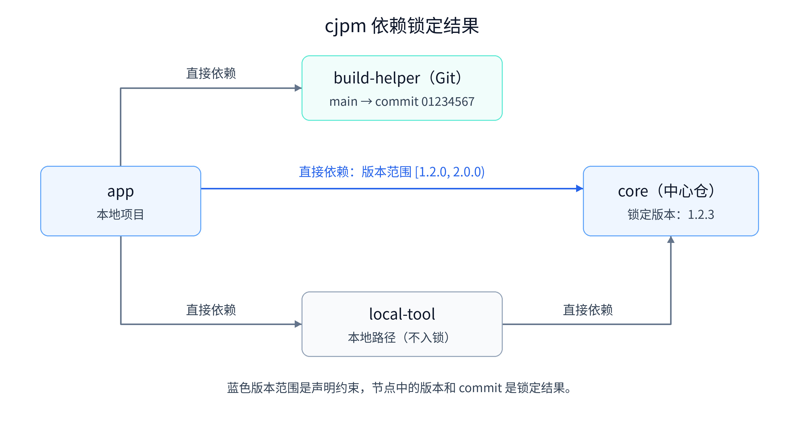
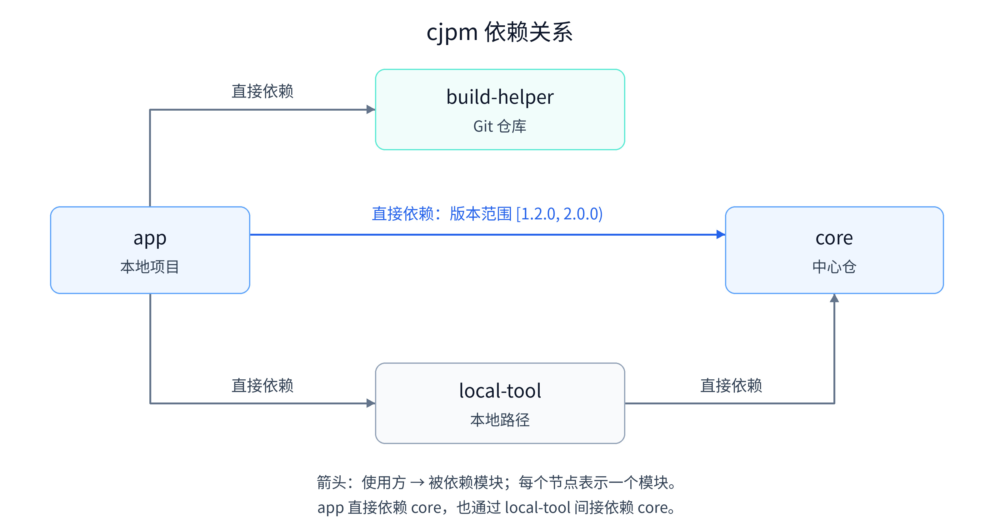
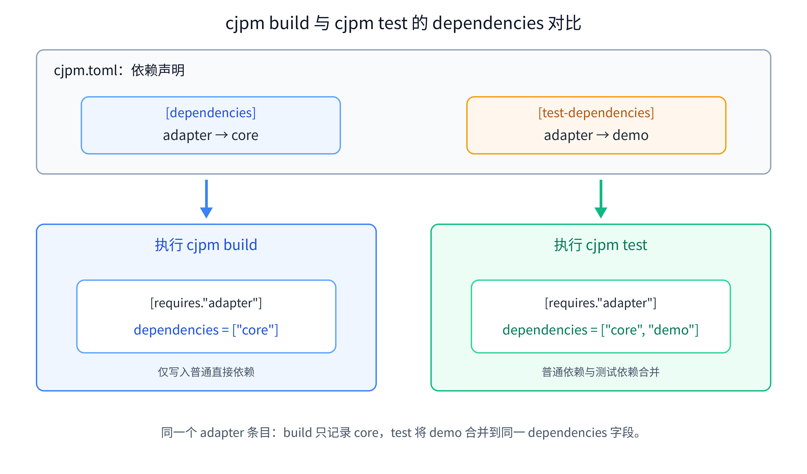
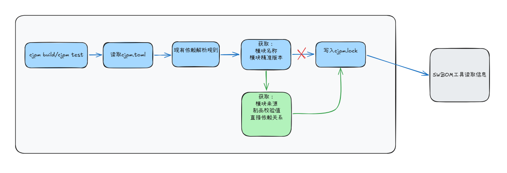

# 架构会议评审：cjpm.lock 增加 SWBOM 所需依赖信息

- CJEEP ID：CJEEP-003
- Author(s)：Sun Chihao
- Status：Reviewing
- Implementation：UnImplemented

# 1、特性需求/问题/动机的来源与价值

SWBOM（Software Bill of Materials，业界通常写作 SBOM）是描述软件组成及模块关系的清单。软件通常包含大量直接和间接依赖，仅靠项目名称无法知道其中使用了哪些第三方模块。发生模块漏洞、许可证合规检查或供应链问题时，需要借助清单定位相关版本及其引入关系。

用户希望在流水线中自动生成与构建产物对应的 SWBOM。每次构建或测试命令成功完成后，流水线应能够获得本次命令实际解析和使用的**源码依赖模块、精确版本、来源、校验值及依赖关系**，并将这些信息交给 SWBOM 工具生成标准格式的清单。随后，漏洞扫描、许可证检查和供应链审计工具读取该清单，定位受影响模块及其引入路径。

为支持问题定位和依赖追溯，SWBOM 需要记录本次构建涉及的模块、精确版本、来源及依赖关系等信息。本方案关注的具体信息如下：

| 信息 | 用途 | Rust 项目示例 |
| --- | --- | --- |
| 模块名称 | 识别模块并匹配漏洞影响范围 | `serde` |
| 精确版本 | 识别模块并匹配漏洞影响范围 | `1.0.228` |
| 模块来源 | 追溯模块的获取位置 | crates.io |
| 制品校验值 | 比对获取的制品内容是否一致 | 下载制品的 SHA-256 值 |
| 直接依赖关系（普通依赖，测试依赖） | 判断模块由谁引入，并还原间接依赖关系 | `app → serde` |

例如，一份 Rust 项目的清单记录 `app` 使用来自 crates.io 的 `serde 1.0.228`。若该版本后来被报告存在漏洞，可以先从清单中定位使用它的项目，再结合实际使用情况判断影响，而不必逐个项目重新解析依赖。

# 2 行业现状分析

以 Cargo 为例，`Cargo.lock` 可作为 SWBOM 所需依赖信息的数据来源：

Cargo.lock 使用 `[[package]]` 条目记录模块名称、精确版本和直接依赖；普通依赖和测试依赖统一记录在 `dependencies` 中。

| 信息 | 用途 | Rust 项目示例 |
| --- | --- | --- |
| 模块名称 | 识别模块并匹配漏洞影响范围 | `serde` |
| 精确版本 | 识别模块并匹配漏洞影响范围 | `1.0.228` |
| 模块来源 | 追溯模块的获取位置 | crates.io |
| 制品校验值 | 比对获取的制品内容是否一致 | 下载制品的 SHA-256 值 |
| 直接依赖关系（普通依赖，测试依赖） | 判断模块由谁引入，并还原间接依赖关系 | `app → serde` |

| 来源 | `source` | `checksum` |
| --- | --- | --- |
| registry | `registry+<索引地址>` | 制品 SHA-256，64 位十六进制，不带 `sha256:` 前缀 |
| Git | Git 地址、可选选择条件及最终 commit | 不记录，以 commit 固定源码 |
| 本地 | 不记录 | 不记录； |

```toml
version = 3

[[package]]
name = "app"
version = "1.0.0"
dependencies = [
 "itoa",
 "serde",
]

[[package]]
name = "itoa"
version = "1.0.18"
source = "git+https://github.com/dtolnay/itoa?rev=1577ed901354d0d7448ac162328f9dbf5183124c#1577ed901354d0d7448ac162328f9dbf5183124c"

[[package]]
name = "serde"
version = "1.0.229"
source = "registry+https://github.com/rust-lang/crates.io-index"
checksum = "4148590afebada386688f18773da617792bf2ef03ffc1e4cbd2b1d45b023e0ba"
dependencies = [
 "serde_core",
]
```

上述锁文件由 Cargo 根据项目及依赖包的配置、registry 索引和 Git 仓库解析生成。使用的完整 `Cargo.toml` 如下：

```toml
[package]
name = "app"
version = "1.0.0"
edition = "2021"

[dependencies]
serde = "1.0"
itoa = { git = "https://github.com/dtolnay/itoa", rev = "1577ed901354d0d7448ac162328f9dbf5183124c" }
```

# 3、本特性的设计/实现方案

## 3.1 cjpm 现状与问题

cjpm 目前没有完全提供 SWBOM 所需信息

| SWBOM 所需信息 | 是否已存在 | 来源 |
| --- | --- | --- |
| 模块名称 | 是 | cjpm.lock |
| 精确版本 | 是 | cjpm.lock |
| 模块来源 | 部分，但格式不统一 | cjpm.lock |
| 制品校验值 | 否 | NA |
| 直接依赖关系 | 否 | NA |

`cjpm.lock` 是 cjpm 自动生成的依赖锁文件，用于固定解析后选定的模块版本和来源。

示例 `cjpm.lock` 文件的图示和内容如下：



```toml
version = 0

[requires]
core = { version = "1.2.3" }
build-helper = { git = "https://example.com/build-helper.git", branch = "main", commitId = "0123456789abcdef0123456789abcdef01234567" }
```

上述锁文件展示 `cjpm` 根据项目及依赖模块的配置、中心仓索引和 Git 仓库解析后的结果。对应本地项目 `app` 的依赖图和 `cjpm.toml` 示例配置如下：



```toml
[package]
name = "app"
version = "1.0.0"
cjc-version = "1.0.0"
output-type = "executable"

[dependencies]
# 中心仓：允许 >= 1.2.0 且 < 2.0.0 的版本
core = "[1.2.0, 2.0.0)"
# Git：解析 main 分支并锁定具体 commit
build-helper = { git = "https://example.com/build-helper.git", branch = "main" }
# 本地模块：对应图中的 local-tool
local-tool = { path = "../local-tool" }
```

## 3.2 目标

补齐 SWBOM 所需的模块精确版本、来源、直接依赖关系和中心仓制品校验信息，支持模块追溯及制品一致性检查；

## 3.3 方案设计

SWBOM 所需信息理论上可以放在三类位置：用户维护的 `cjpm.toml`、现有的 `cjpm.lock`，或新增独立的 SWBOM 文件。

| 存放位置 | 用途及适用性 | 结论 |
| --- | --- | --- |
| `cjpm.toml` | 由用户维护，用于声明依赖及版本范围、来源要求；不适合混入自动解析产生的精确版本、checksum 和最终依赖关系。 | 不推荐，避免混合用户配置与解析结果。 |
| `cjpm.lock` | 已有记录依赖解析结果的结构和自动生成流程，可复用现有框架扩展字段，**不增加用户手工维护操作**；用户仍可在版本管理中看到锁文件变化。 | 推荐，新增信息符合锁文件职责。 |
| 新增独立文件 | 可单独保存 SWBOM 所需信息，但需要额外定义格式、生成流程，并保证其与依赖解析结果一致。 | 不优先采用，增加实现和一致性维护成本。 |

若将 SWBOM 所需信息写入 `cjpm.lock`, 则需在 `cjpm.lock` 增加以下新字段：

| 条目字段 | 声明与规则 |
| --- | --- |
| `source` | 记录依赖来源：中心仓依赖记录为 `registry+<url>`，Git 依赖记录为 `git+<url>#<resolved-commit>` |
| `checksum` | 记录制品校验值：仅中心仓条目，格式为 `sha256:<64 位小写十六进制>`；Git 条目省略 |
| `dependencies` | 记录解析范围内的普通和测试直接依赖：记录完整模块名，排序并去重，无依赖时写 `[]` |

**以上新增字段均在 `cjpm.lock` 自动生成，无需用户手工维护操作**

`cjpm.lock` 新增字段后示例如下：

```cjpm.lock
version = 1

[requires."adapter"]
version = "1.0.0"
source = "registry+https://repo.example.com"
checksum = "sha256:aaaaaaaaaaaaaaaaaaaaaaaaaaaaaaaaaaaaaaaaaaaaaaaaaaaaaaaaaaaaaaaa"
dependencies = ["core"]

[requires."core"]
version = "1.2.3"
source = "registry+https://repo.example.com"
checksum = "sha256:bbbbbbbbbbbbbbbbbbbbbbbbbbbbbbbbbbbbbbbbbbbbbbbbbbbbbbbbbbbbbbbb"
dependencies = []

[requires."mock"]
version = "0.5.0"
source = "git+https://example.com/mock.git#0123456789abcdef0123456789abcdef01234567"
dependencies = []

[scripts."build_tool"]
version = "0.5.0"
source = "registry+https://repo.example.com"
checksum = "sha256:cccccccccccccccccccccccccccccccccccccccccccccccccccccccccccccccc"
dependencies = []
```

#### 执行 cjpm build 与 cjpm test 时，cjpm.lock 的 dependencies 对比

下面单独说明同一个模块的字段变化：假设 `adapter` 的普通依赖是 `core`，测试依赖是 `demo`，其 `cjpm.toml` 中声明如下：

```toml
[dependencies]
core = "1.2.3"

[test-dependencies]
demo = "0.5.0"
```



以下是锁文件片段，仅展示 `adapter` 的依赖字段，省略其版本、来源、checksum 和被引用模块的条目。示例以 `adapter` 已入锁、执行 `cjpm test` 时其测试依赖生效为前提，不表示自动启用所有第三方模块的测试依赖。

执行 `cjpm build` 时，只记录普通直接依赖：

```toml
[requires."adapter"]
dependencies = ["core"]
```

执行 `cjpm test` 时，将普通直接依赖 `core` 和测试直接依赖 `demo` 合并到同一个 `dependencies` 字段：

```toml
[requires."adapter"]
dependencies = ["core", "demo"]
```

## 3.4 整体流程设计



图中蓝色部分为 cjpm 已有的配置读取和依赖解析和信息获取流程；绿色部分为本方案新增得获取 SWBOM 所需信息的流程。

## 3.5 规格限制
当前中心仓仅支持源码制品的上传和下载，不支持二进制制品的上传和下载。因此，本次方案只涉及扩展 SWBOM 所需的源码模块依赖信息，不记录二进制依赖。后续若中心仓支持二进制制品及其版本、来源和校验信息，可在字段中增加二进制依赖相关字段。

# 4、特性影响分析

## 4.1 系统位置及周边接口

不涉及

## 4.2 环境依赖

不涉及新增环境依赖。

## 4.3 模块、依赖关系和约束

不涉及新增模块或模块间依赖关系调整。

## 4.4 前后版本兼容性

| 读取方向 | 行为 |
| --- | --- |
| 新版 cjpm 读取旧版 cjpm.lock | 支持；成功解析并写回时升级为新版 cjpm.lock |
| 旧版 cjpm 读取新版 cjpm.lock | 不兼容；使用新版 cjpm.lock 需要升级 cjpm，回退工具版本时也需恢复对应的旧版锁文件 |

### 用户如何更新 `cjpm.lock`

| 场景 | 用户操作 | 结果 |
| --- | --- | --- |
| 使用新版 cjpm 迁移旧版 cjpm.lock | 执行 `cjpm build`、`cjpm test` 等会写入锁文件的命令 | 读取旧版 cjpm.lock，并成功迁移为新版 cjpm.lock |
| 主动重新解析依赖 | 修改 `cjpm.toml` 后执行 `cjpm update` | 按 cjpm 的更新语义重新选择依赖，并生成新版 cjpm.lock |
| 从头生成锁文件 | 删除 `cjpm.lock` 并执行相应的 `cjpm build` 或 `cjpm test` | 重新解析并生成新版 cjpm.lock；|

## 4.5 外部用户是否感知

- 用户会看到 `cjpm.lock` 条目增加 `source`、`checksum` 和 `dependencies`。
- 用户仍通过原有 cjpm 命令操作，不需要手工填写新增字段；

# 5、DFX 分析

不涉及

# 6、可信分析

不涉及

# 7、关键 DT 用例简述

| 测试用例名称 | 预置条件与关键步骤 | 预期结果 |
| --- | --- | --- |
| 新旧迁移 | 旧版 cjpm.lock 锁定版本仍满足配置，执行会写锁的命令 | 保留可用版本和 Git commit，补齐新增信息并写出新版 cjpm.lock |
| 新旧 cjpm 版本兼容 | 分别以新版 cjpm 读取新旧版 cjpm.lock、以旧版 cjpm 读取新版 cjpm.lock | 新版 cjpm 可读取两种格式；旧版 cjpm 不支持新版 cjpm.lock，核实并记录其拒绝行为 |
| 新版 cjpm.lock 读写 | 加载符合 4.2、4.3 节的文件并重新写出 | 模块名、版本、来源和依赖关系不变，输出模块名子表 |
| inline table 读取 | 将 新版 cjpm.lock 条目以等价的 inline table 表示后读取 | 解析结果与子表一致，重新写出时使用子表 |
| 未知版本与格式错误 | 构造未知版本、未知字段、类型错误、重复条目和悬空引用 | 明确报错，原文件不变 |
| 确定性生成 | 相同依赖图按不同输入顺序生成 | 文件内容逐字节一致，重复生成无差异 |
| 模块名及直接引用 | 使用含组织名的模块，并构造 `adapter → core` | 完整模块名保留，`adapter.dependencies` 只引用 `core`，精确版本从目标条目读取 |
| 统一依赖字段 | 当前解析结果包含普通和测试直接依赖，同一目标可被两类声明引用 | 统一写入 `dependencies` 并去重，不生成独立的测试依赖字段 |
| build/test 依赖字段切换 | 按 4.2 节为已入锁的 `adapter` 声明普通依赖 `core`、测试依赖 `demo`，依次执行 `cjpm build` 和会激活该测试依赖的 `cjpm test` | `adapter.dependencies` 从 `["core"]` 变为 `["core", "demo"]`；test 结果包含 `demo` 条目，不生成独立的测试依赖字段 |
| 命令范围 | 同时声明普通和测试依赖，分别运行相关命令 | 节点和边与现有命令的解析结果一致，不因统一字段扩大解析范围 |
| 中心仓来源 | 解析中心仓模块并校验制品 | 写入规范化 source 和 `sha256:` 校验值 |
| Git 锁定 | Git 解析到最终 commit | source 固定完整 commit，不写 checksum |
| 来源凭据保护 | 来源 URL 含访问凭据 | 文件和诊断不泄露凭据；无法安全处理时失败，不写回 |
| checksum 不一致 | 下载或缓存制品哈希与锁定值不同 | 停止使用制品，不覆盖原 checksum 和锁文件 |
| 失败与原子写回 | 模拟解析失败、校验失败或写入中断 | 原锁文件完整且不变 |
| 脚本依赖 | 构建脚本有依赖，更新 `[scripts]` | 使用相同字段规则，不覆盖 `[requires]` |

# 8、结论
