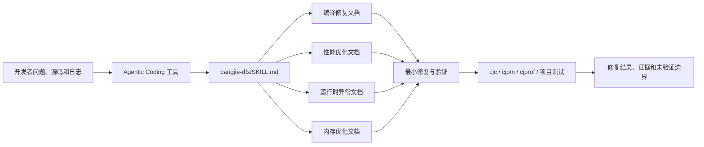
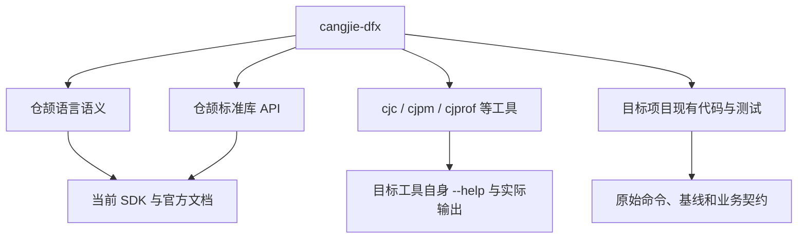
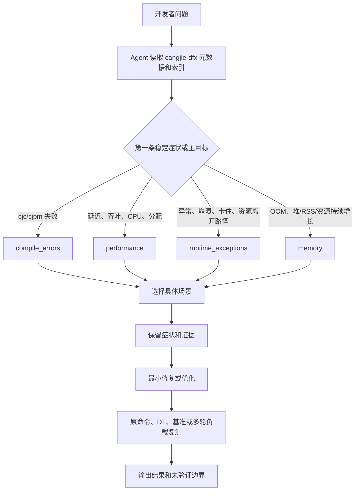

# 仓颉 DFX 场景处理 Skill 架构设计

## 1、特性需求/问题/动机的来源与价值

### 1.1 需求来源

本特性来自「仓颉开源社区学习赛」高级任务：

> 新增典型 DFX 场景（编译修复、性能优化、异常、内存优化）处理 Skill。针对新兴的编程语言仓颉，在使能 Agentic Coding 的过程中，仍存在不少场景需要借助 Skills 来使大模型更好地生成代码并进行优化，有且不限于典型报错的修复建议、高性能编码写法、运行时异常的修复以及内存的优化等，期望通过构建更多场景化解决方案 Skills 来增强仓颉的 Agentic Coding 开发能力，提交代码至 CangjieSkills。

目标实现仓库为 [`Cangjie-SIG/CangjieSkills`](https://atomgit.com/Cangjie-SIG/CangjieSkills)，面向使用 Agentic Coding 工具开发仓颉项目的开发者。

### 1.2 当前问题

通用大模型能够解释常见编程问题，但在处理仓颉工程时，可能把其他语言和工具链中的经验直接迁移到仓颉，产生以下问题：

1. 根据最后一条级联诊断修改代码，没有先定位首个根因错误。
2. 混用 Java、C/C++、Rust 等语言的语法、API、异常模型或构建参数。
3. 把 Debug 与非 Debug、不同 SDK、不同输入或不同机器的性能数据直接比较。
4. 看到异常文本后直接给出修复，没有保留触发输入、调用栈和失败路径。
5. 把单点 RSS 上升直接判断为仓颉堆泄漏，忽略原生内存、句柄、缓存容量和运行时高水位。
6. 只给出“优化写法”，不验证业务语义、异常路径和前后基线是否一致。
7. 在缺少目标平台或工具能力时，生成当前 SDK 不支持的命令、参数或辅助 API。

这些问题会增加无效修改、兼容性回归和错误性能结论的风险，也会提高开发者核验模型输出的成本。

### 1.3 用户视角的前后对比

以“仓颉项目编译失败”为例。

特性实现前，开发者输入：

> `cjpm build` 报错，帮我修复。

模型可能只读取末尾错误，改动多个文件，或者用未经确认的类型转换掩盖问题。

特性实现后，Agent 按需读取编译修复文档并完成以下工作：

1. 保留原始命令、首个稳定诊断和对应源码位置。
2. 将问题定位到类型、包与可见性、宏、CFFI、语法、函数、类型系统、模式匹配或构建上下文中的具体问题族。
3. 对照仓颉语义给出错误代码、根因和最小修复结构。
4. 重跑原始命令，并根据项目情况执行相关 `cjpm test`。
5. 明确已经验证的范围以及尚未验证的平台、target 或依赖。

性能、运行时异常和内存问题采用相同的场景化结构：先识别可观察症状和证据，再给出仓颉代码修复与验证方式，而不是仅输出经验性建议。

### 1.4 建设目标

本特性拟新增一个 `cangjie-dfx` Skill，并通过四个按需读取的方向文档提供仓颉 DFX 场景知识：

1. **编译修复**：处理 `cjc`/`cjpm` 编译失败、类型与 Option、包与导入、宏、CFFI、语法和构建上下文等问题。
2. **性能优化**：提供有证据的高性能编码写法，覆盖复杂度、集合、字符串、分配、并发、I/O 和跨语言边界等问题。
3. **运行时异常**：处理 Option、输入契约、集合边界、异常传播、Future、并发、资源和原生故障等问题。
4. **内存优化**：区分仓颉堆、RSS、原生内存和系统资源，处理无界状态、长期持有、资源生命周期及多轮稳态问题。

当前候选实现包含 1 个入口文件和 4 个方向文档，共 5 个 Markdown 文件。四个方向文档包含 118 个二级场景小节。场景数量用于说明覆盖范围，不作为质量目标；每个场景仍需具备问题表现、错误或低效代码、原因、修复方式和验证要点。

### 1.5 非目标

本特性不承担以下职责：

1. 不替代仓颉语言、标准库、扩展标准库和工具链的完整参考文档。
2. 不实现新的编译器、运行时、标准库或分析器能力。
3. 不承诺自动修复所有未知缺陷，也不把场景标题匹配等同于根因诊断。
4. 不提供 HTTP、TLS、数据库、GUI 等业务框架的完整开发教程。
5. 不在没有可比基线时给出性能提升比例，不在只有 RSS 单点时判断内存泄漏。
6. 不修改用户项目、安装依赖或执行高成本诊断；实际操作由承载 Skill 的 Agent 在用户授权范围内完成。

## 2、特性影响分析

### 2.1 系统位置

`cangjie-dfx` 位于 Agentic Coding 工具与仓颉项目之间的知识指导层，不进入仓颉程序的编译产物或运行路径。



Skill 提供知识和工作方式，具体命令仍由 Agent 根据当前项目、SDK、平台和工具 `--help` 选择。仓颉编译器、项目管理工具、Profiler 和用户项目均不是本特性的实现模块。

### 2.2 文件与模块影响

拟在 `CangjieSkills` 中新增以下文件：

```text
.agents/skills/cangjie-dfx/
├── SKILL.md
├── compile_errors/
│   └── README.md
├── performance/
│   └── README.md
├── runtime_exceptions/
│   └── README.md
└── memory/
    └── README.md
```

各文件职责如下：

| 文件 | 职责 | 当前规模 |
| --- | --- | ---: |
| `SKILL.md` | frontmatter、触发描述和四个方向的一级索引 | 14 行 |
| `compile_errors/README.md` | 编译诊断、修复和完成门槛 | 1288 行、30 个场景小节 |
| `performance/README.md` | 高性能编码、基准和热点证据 | 1599 行、32 个场景小节 |
| `runtime_exceptions/README.md` | 执行故障、异常、并发和资源问题 | 1113 行、27 个场景小节 |
| `memory/README.md` | 堆、RSS、长期持有、句柄和原生内存 | 1234 行、29 个场景小节 |

上述规模是当前候选实现的审查快照，后续以最终合入内容为准。实现 PR 不修改已有 Skill，不新增脚本、图片、脑图、评测报告或其他辅助目录。

### 2.3 周边依赖关系



关键约束如下：

1. 场景文档中的仓颉语法和 API 需要与当前 SDK 行为一致。
2. 同名工具在不同 SDK 版本中的参数可能不同，不能跨子命令推断参数。
3. 性能结论必须绑定 SDK、平台、构建配置、输入、并发度和测量方法。
4. 内存结论必须区分仓颉堆、进程 RSS、原生内存和系统资源。
5. CFFI 场景需要同时尊重仓颉、C 头文件、目标 ABI 和内存所有权契约。
6. 用户项目已有测试和业务语义优先于通用示例。

### 2.4 环境依赖与跨平台影响

本特性本身是 Markdown 文档，不依赖特定 target、后端或操作系统；但文档指导的诊断能力具有平台差异。

| 能力 | Windows | Linux | macOS | 设计约束 |
| --- | --- | --- | --- | --- |
| `cjc`/`cjpm` 编译与测试 | 依 SDK 支持 | 依 SDK 支持 | 依 SDK 支持 | 使用当前环境的真实命令和输出 |
| `cjpm bench` | 依 SDK 支持 | 依 SDK 支持 | 依 SDK 支持 | 固定构建配置和输入后比较 |
| `cjprof` CPU/堆分析 | 不支持 | 依 SDK、权限和系统配置 | 不支持 | `cjprof` 仅支持 Linux；其他平台使用可用的系统采样器或项目计数证据 |
| RSS、句柄和原生资源采样 | 平台接口不同 | 平台接口不同 | 平台接口不同 | 允许使用平台采样器，但结论需标明来源 |
| CFFI、动态库和 ABI | 目标相关 | 目标相关 | 目标相关 | 验证目标架构、导出符号和实际产物 |

缺少目标工具或目标平台时，Skill 应指导 Agent 记录未验证边界，不用其他平台的结果代替。

### 2.5 兼容性分析

1. **语言兼容性**：不修改仓颉语法、语义或编译行为。
2. **API/ABI 兼容性**：不新增或修改仓颉 API/ABI，不改变用户产物。
3. **仓库兼容性**：只新增独立 Skill 目录，不修改已有 Skill 的 frontmatter 和相对链接。
4. **工具兼容性**：Agent Skills 兼容 `.agents/skills` 的工具可发现该目录；不支持该规范的工具不受影响。
5. **版本兼容性**：具体语法、API 和参数以用户当前 SDK、工具帮助和官方文档为准，文档不得把单一版本行为声明为所有版本行为。

本特性为纯新增，删除该目录即可回退，不需要数据迁移。

### 2.6 外部用户感知

外部用户能够在支持 Agent Skills 的工具中发现 `cangjie-dfx`，并在询问编译、性能、运行时异常或内存问题时获得更具仓颉针对性的回答。

用户项目的源代码、构建配置和运行行为不会因安装 Skill 自动变化。是否执行编译、测试、基准或分析命令，仍取决于 Agent 能力和用户授权。

### 2.7 性能与空间影响

本特性不进入仓颉程序运行路径，对用户产物的时间和空间性能没有直接影响。

主要开销发生在 Agent 上下文：四个方向文档正文较长，如果每次全部加载会增加上下文和推理成本。设计通过 14 行入口索引实现按需加载，先根据问题方向读取一个文档；仅当新证据指向另一问题方向时才扩展读取范围。

诊断过程可能执行编译、测试、基准或 Profiler，这些开销属于 Agent 执行用户任务的成本，不是 Skill 运行时开销。高成本操作应在明确范围后执行，并优先使用最小相关用例。

## 3、业界竞品分析

### 3.1 Agent Skills 的通用做法

GitHub 将 Agent Skill 定义为可在相关任务中加载的指令、脚本和资源目录，用于提高 Agent 完成专门、可重复任务的能力，并支持 `.agents/skills` 项目目录。该模式说明 Skill 的主要价值是提供稳定的任务知识和工作方式，而不是替代编译器或 Profiler。参考：[About agent skills](https://docs.github.com/en/copilot/concepts/agents/about-agent-skills)。

成熟语言生态中的 Agent Skills 多按具体任务拆分，例如 Java 构建、测试、迁移和重构，而不是把完整语言知识装入一个文件。本方案借鉴“专门任务 + 按需加载”，同时考虑仓颉 DFX 的四类问题可能在同一工程中连续出现，采用一个入口加四个方向文档。

### 3.2 C/C++ 诊断工具

Clang AddressSanitizer 通过编译插桩和运行时支持检测越界、释放后使用、重复释放等内存错误；UndefinedBehaviorSanitizer 检测越界、空指针、未对齐访问、整数溢出等未定义行为。参考：[AddressSanitizer](https://clang.llvm.org/docs/AddressSanitizer.html)、[UndefinedBehaviorSanitizer](https://clang.llvm.org/docs/UndefinedBehaviorSanitizer.html)。

这类工具能够提供机器证据，但不能直接解释仓颉 Option、Future、Resource、CFFI 和仓颉工具链语义。本方案不复刻 Sanitizer，而是借鉴“以实际报告定位问题”的证据原则，并将其约束到仓颉场景。

### 3.3 Java 诊断工具

Java Flight Recorder 能够记录和分析代码执行、分配、GC、锁和 I/O 等性能事件。参考：[Troubleshoot Performance Issues Using Flight Recorder](https://docs.oracle.com/en/java/javase/24/troubleshoot/troubleshoot-performance-issues-using-jfr.html)。

其优势是工具和运行时集成成熟；局限是 JVM 事件模型和命令不能直接迁移到仓颉。本方案借鉴“先记录再判断、区分分配与长期持有”的方法，但使用仓颉当前可用的工具和项目证据。

### 3.4 方案差异

| 方案 | 主要能力 | 优点 | 对仓颉 Agentic Coding 的不足 |
| --- | --- | --- | --- |
| 通用 Agent Skill | 稳定任务流程和上下文 | 可跨 Agent 加载 | 缺少仓颉语言和工具链细节 |
| C/C++ Sanitizer | 原生内存和未定义行为检测 | 报告直接、问题定位明确 | 不能解释仓颉语言层语义 |
| Java JFR | JVM 性能和运行事件分析 | 低开销、事件维度丰富 | JVM 模型与仓颉不同 |
| `cangjie-dfx` | 仓颉 DFX 场景知识和验证约束 | 覆盖仓颉语义、工具链与 CFFI | 不新增底层检测能力，依赖现有证据 |

## 4、本特性的设计/实现方案

### 4.1 总体设计

本特性采用“一个入口 Skill + 四个按需方向文档”的结构。



分类用于控制读取范围，不要求问题永久互斥。例如热点临时分配首先属于性能问题；释放或 GC 后仍跨轮增长才进入内存问题。编译未通过时先修复编译阻塞，再进行性能或运行时测量。

### 4.2 Skill 入口设计

`SKILL.md` 使用标准 frontmatter：

```yaml
---
name: cangjie-dfx
description: "提供仓颉语言 Agentic Coding 典型 DFX 场景处理文档……"
---
```

入口正文只保留四个相对链接及覆盖范围说明：

- `[编译修复](./compile_errors/README.md)`
- `[性能优化](./performance/README.md)`
- `[运行时异常](./runtime_exceptions/README.md)`
- `[内存优化](./memory/README.md)`

入口不重复具体场景内容，避免每次触发都加载全部正文。链接均限制在 Skill 自身目录内，不依赖其他 Skill 的相对路径。

### 4.3 场景内容模型

四个方向文档以问题族组织二级索引。具体场景使用统一的知识结构：

1. **常见表现**：用户提示、错误信息或可观察指标。
2. **错误或低效代码**：体现仓颉问题的最小代码或替换片段。
3. **问题说明**：解释语言语义、工具行为、复杂度或生命周期根因。
4. **修正代码**：给出保持业务语义的最小修改结构。
5. **修复与验证**：说明正常、失败、边界、性能或资源路径如何验证。

同一文档内先按仓颉语言或工程知识分类，再给出具体问题。例如编译修复文档按类型系统、包与导入、宏、CFFI、语法、函数、class/struct/interface、match 和 `cjpm` 构建上下文组织，而不是只按编译器错误文本罗列。

### 4.4 编译修复方向

编译修复文档覆盖以下问题族：

1. 类型转换、Option、泛型约束和不型变。
2. 包声明、导入冲突、可见性和重新导出。
3. 宏包边界、宏展开阶段和宏依赖构建。
4. CFFI 类型映射、`unsafe`、链接、ABI 和动态库装载。
5. 声明、表达式、初始化状态和 Bool 条件。
6. 函数、Lambda、返回类型和重载歧义。
7. class、struct、interface、继承和构造链。
8. `match` 穷举、分支类型和绑定作用域。
9. `cjpm.toml`、依赖、workspace、Profile 和子命令上下文。
10. 首个根因、编译器崩溃、最小复现和版本回归。

修复完成门槛是重跑原始命令和相关项目测试，并说明目标平台和版本边界；单文件编译不能替代真实项目构建。

### 4.5 性能优化方向

性能文档先规定基线可比性，再覆盖：

1. 算法复杂度、重复计算和提前停止。
2. 集合选型、成员查询、容量增长和迭代语义。
3. 字符串拼接、Byte/Rune、`split`/`lazySplit`。
4. 中间集合、clone、数组转换和缓冲复用。
5. Lambda、闭包、异常热路径和抽象成本。
6. 缓存、预计算、失效语义和命中率。
7. `spawn`、Future、锁、Atomic 和任务粒度。
8. I/O、日志、批处理和基准消费。
9. CFFI 调用粒度、String/CString 和原始数组窗口。
10. class/struct、Any、背压、超时和取消。

性能结论必须来自相同 SDK、机器、构建配置、输入、并发度、预热和测量方法。没有基线时只能给出优化假设和验证方案。

### 4.6 运行时异常方向

运行时异常文档覆盖：

1. Option 缺省、解析失败和可选链副作用。
2. 输入参数、容量和调用顺序契约。
3. 溢出、除零、Range、数组边界和集合修改。
4. 具体异常捕获、异常转换和 `finally` 根因保留。
5. Future 异常、超时、取消和后台任务生命周期。
6. Condition、Mutex、死锁和共享状态复合操作。
7. Resource、文件、流、EOF、权限和关闭所有权。
8. CFFI 空指针、指针有效期、重复释放、ABI 和原生崩溃。
9. StackOverflow、OOM、资源耗尽和平台退出状态。

修复不仅要让异常消失，还要验证正常、失败和边界路径，避免通过宽泛捕获或无依据默认值改变业务语义。

### 4.7 内存优化方向

内存文档覆盖：

1. 仓颉堆、RSS、GC、多轮负载和堆快照边界。
2. 临时集合、字符串、重复转换和对象池。
3. 无界集合、容量高水位、缓冲复用和共享所有权。
4. 缓存容量、过期、淘汰、低命中和 WeakRef 误用。
5. 大对象、整体读入、分块处理、批次和多份表示。
6. 全局变量、单例、注册表、父子引用和可达性。
7. 闭包、回调、订阅和周期任务生命周期。
8. Future、ThreadLocal、任务队列和背压。
9. Resource、句柄、CFFI 原生内存和 raw-data 生命周期。

单次 RSS 下降、`clear()`、强制 GC 或 WeakRef 不能单独证明修复。完成门槛是相同多轮负载下对象、资源或容量达到有界稳态，并说明内存类别和仍未验证的平台。

### 4.8 未命中场景处理

文档不是封闭规则库。遇到未直接列出的场景时，Agent 应先将问题归入最接近的方向，使用当前方向提供的证据和验证原则形成一个可证伪假设；如果新证据无法解释问题，再查询语言、标准库、工具链或其他方向文档。

未知项必须标明“未观察”或 `unknown`，不得把没有日志、基线、堆证据或目标平台材料表述为已经排除。

### 4.9 用户接口与异常返回

本特性没有仓颉语言 API。用户可感知接口是 Skill 的名称、description、索引链接和 Agent 输出。

| 接口 | 正常行为 | 异常或降级行为 |
| --- | --- | --- |
| Skill 发现 | Agent 根据 description 发现 `cangjie-dfx` | 工具不支持 Agent Skills 时不加载，不影响仓颉工程 |
| 文档加载 | 根据问题读取一个方向文档 | 相对链接失效时视为实现缺陷，提交前静态检查 |
| 场景诊断 | 输出症状、根因、最小修复和验证 | 证据不足时输出待验证项，不虚构结论 |
| 命令建议 | 使用当前 SDK 和子命令支持的参数 | 工具不可用时给出降级验证方案 |
| 代码示例 | 明确可独立编译示例或上下文替换片段 | 存在业务占位时不得称为可直接执行代码 |

### 4.10 方案选择

#### 方案 A：单个超长 `SKILL.md`

- 优点：文件数量少，所有内容可一次检索。
- 缺点：每次触发加载 5000 余行内容，上下文成本高；多人维护容易产生冲突。

#### 方案 B：一个入口 + 四个方向文档（采用）

- 优点：入口稳定，四类任务易发现；具体内容按需加载；同一问题跨方向时仍共享一个 Skill 名称。
- 缺点：需要维护相对链接和方向边界；单个方向文档仍然较长。

#### 方案 C：四个独立顶层 Skill

- 优点：触发更精细，单次加载范围更小。
- 缺点：description 容易重叠；复合问题可能重复加载；公共边界规则容易分叉。

#### 方案 D：为每个具体场景建立独立 Skill

- 优点：单场景触发最精确。
- 缺点：目录和元数据数量过大，发现、维护和去重成本高，不符合问题族共享知识的特点。

当前采用方案 B。后续只有在某一方向具备独立用户群、稳定触发词和明显的上下文收益时，才评估拆为独立顶层 Skill。

## 5、DFX 分析

### 5.1 可靠性

1. 入口只负责索引，具体结论由方向文档中的证据要求约束。
2. 编译修复要求重跑原命令，避免把局部语法成立当作工程修复完成。
3. 性能结论要求可比基线，避免根据代码形态直接宣称提升。
4. 异常修复覆盖正常、失败和边界路径，避免吞掉异常改变语义。
5. 内存结论要求多轮趋势和第二类证据，避免把 RSS 高水位误报为堆泄漏。

### 5.2 可维护性

1. 四个方向的目录和一级索引稳定，具体场景可在对应文档内增量维护。
2. 场景以仓颉知识域组织，避免相同问题因错误文本不同而重复。
3. 示例代码和验证说明保持相邻，降低修改时遗漏验证条件的概率。
4. 不复制其他 Skill 的完整内容；语言或工具事实发生变化时，以当前 SDK 和官方资料复核。

### 5.3 可用性

1. description 同时覆盖用户常用词和四类任务目标，便于 Agent 发现。
2. 入口使用中文名称和相对链接，开发者可直接浏览。
3. 每个方向都提供分级索引，不要求用户预先知道编译器或运行时内部模块名。
4. 工具不可用、材料不完整或平台不一致时提供明确降级路径。

### 5.4 性能与资源

1. 入口保持精简，避免无关方向占用 Agent 上下文。
2. 文档不自动执行 benchmark、Profiler 或堆快照。
3. 指导 Agent 优先运行最小相关构建、测试和有界负载。
4. 大型日志和堆快照可能占用磁盘或包含敏感内容，需在实际任务中确认范围和保存位置。

### 5.5 可演进性

新增场景应满足至少一项：存在稳定的仓颉特有语义、工具链差异、可复现的错误模式或通用模型容易误判的证据边界。仅有业务名称不同、根因和修复结构相同的案例不重复新增。

## 6、可信分析

| 维度 | 风险 | 控制措施 |
| --- | --- | --- |
| 安全性 Security | Agent 执行来源不明命令、修改系统路径或掩盖告警 | 命令以当前工具帮助和项目约束为准；修复采用最小改动，不通过删除测试或屏蔽诊断完成 |
| 可靠性 Reliability | 错误分类、级联诊断或不可比数据导致错误结论 | 保留原命令和首因；性能使用相同基线；内存使用多轮和多类证据 |
| 韧性 Resilience | SDK、target 或平台工具不可用 | 明确能力检测和降级路径；保留未验证边界，不用其他平台结果替代 |
| 可用性 Availability | 全量构建、基准或 Profiler 长时间占用资源 | 优先最小相关范围；高成本步骤由承载 Agent 按用户授权执行 |
| 隐私 Privacy | 日志、路径、堆快照或缓存键包含私有数据 | 不要求上传原始敏感材料；示例要求脱敏，快照先确认隐私和磁盘边界 |
| 无害 Safety | 错误修复破坏业务语义、资源所有权或 ABI | 采用最小修复；验证正常、失败、边界和目标平台；CFFI 以真实头文件和 ABI 为准 |

本特性不采集、不保存也不上传用户数据；具体 Agent 工具的权限和数据处理仍由其自身安全模型负责。

## 7、关键 DT 用例简述

本特性不包含仓颉运行时代码，DT 对象是 Skill 的发现、按需读取、回答质量和仓颉示例正确性。实现 PR 仅提交 5 个 Skill 文档；测试使用临时仓颉工程、目标仓库既有任务和 OpenCode 会话，不把测试生成物、截图或评测报告混入实现提交。

| 测试用例名称 | 预置条件 | 用例关键步骤 | 预期结果 |
| --- | --- | --- | --- |
| frontmatter 与链接完整性 | 检出 5 个候选文件 | 解析 YAML；检查 name/description；解析四个相对链接 | Skill 可发现，链接均指向存在的当前目录文件 |
| 编译类型错误修复 | 当前仓颉 SDK；错误代码将 String 赋给 Int64 | 使用原命令复现；询问 Agent；应用最小修复；重编译 | 读取编译文档；解释类型根因；修复后原命令通过 |
| Option 编译与运行边界 | `?T` 被当作 `T` 或对 None 强制取值 | 分别构造编译失败和运行失败；执行 Agent 修复 | 两类问题进入正确方向；Some/None 路径均被验证 |
| 宏包构建错误 | 主包引用错误宏依赖或宏包配置错误 | 运行 `cjpm build`；交给 Agent 定位；复测 | 不把宏展开问题当普通运行时异常，保留包边界 |
| CFFI 链接与生命周期 | 最小 C 库和仓颉 foreign 声明 | 分别触发链接失败、空指针或重复释放风险 | 区分编译/链接、运行时和原生内存证据，不虚构 ABI |
| 长字符串提前消费 | 长输入只需要第一个分隔字段 | Agent 比较 `split` 与 `lazySplit` 方案；校验短/长、首/尾命中和完整遍历 | 给出语义等价检查和可比 benchmark，不保证固定提升 |
| 异常传播修复 | 固定输入触发可恢复异常 | 保留异常类型、消息和最小输入；修复并执行相关测试 | 不使用宽泛捕获或无依据默认值，正常与失败路径通过 |
| 资源异常路径 | 资源创建后抛异常或提前返回 | 重复运行正常、异常和提前返回路径，记录创建/关闭计数 | 资源仅关闭一次，计数达到有界稳态 |
| 内存增长取证 | 相同多轮负载下集合或缓存持续增加 | 同时记录条目数、仓颉堆或 RSS；应用容量/生命周期修复；复测 | 说明具体内存类别；修复后状态有界，不要求 RSS 回到初始值 |
| 单点 RSS 负例 | 只有一次峰值后的 RSS 数据 | 询问是否存在内存泄漏 | Agent 拒绝直接判定，要求负载时间线和第二类证据 |
| 未命中场景 | 构造不在示例标题中的仓颉故障 | 给出项目、SDK、原命令、输入和实际结果 | 使用最接近方向的证据方法，不强套标题，不虚构结论 |
| 按需加载 | 分别提出单一编译、性能、异常和内存问题 | 在全新 Agent 会话中记录读取文件 | 每个单一问题只需读取入口和对应方向文档，无关方向不成为回答前提 |
| 跨平台边界 | 当前环境缺少目标平台或专属工具 | 询问目标平台崩溃或 profile 问题 | 明确未验证平台和降级方法，不输出伪造的成功结果 |
| 复杂工程辅助 | 使用 CangjieSkills 既有 JSON Parser、宏 DSL、CFFI 或 Web 框架任务 | 在实现阶段注入编译、异常、性能或资源问题 | DFX Skill 只处理诊断与优化环节，不替代算法和框架设计 |

仓颉代码示例以当前 SDK 实际编译或项目测试为准。基准场景只比较同环境结果，不把一次测试值写入长期文档作为固定结论。

## 8、结论

本方案拟在 `CangjieSkills` 中新增 `cangjie-dfx`，使用一个精简入口索引和四个按需方向文档，面向仓颉编译修复、高性能编码、运行时异常和内存优化场景提供问题表现、根因、修复代码和验证方法。

方案不修改仓颉语言、编译器、运行时、标准库或工具链 API/ABI，不进入用户程序运行路径。主要风险是知识准确性、上下文规模和跨版本差异，分别通过真实 SDK 验证、按需加载、可比基线和未验证边界控制。

待 Team 评审确认：

1. 顶层 Skill 名称使用 `cangjie-dfx`。
2. 采用“一个入口 + 四个方向文档”，不拆为四个或更多顶层 Skill。
3. 实现 PR 仅新增上述 5 个 Markdown 文件。
4. 关键 DT 采用临时仓颉工程、现有任务和 Agent 黑盒测试，不将辅助测试资产并入实现 PR。

评审结论：待对应 Team 评审。

## 附录一：可测试性设计

1. 静态检查 frontmatter、相对链接、Markdown 代码围栏和空白错误。
2. 从正文抽取可独立示例，在当前仓颉 SDK 下进行编译或运行验证。
3. 对编译、性能、异常和内存各选择代表性场景执行 OpenCode 黑盒测试。
4. 对性能场景同时验证语义等价和基准可比性；没有可比数据时不计算提升。
5. 对内存场景使用多轮负载、业务计数和至少一类内存或资源证据。
6. 使用未命中问题验证 Skill 能应用证据方法，而不是仅复述已有标题。
7. 复核实现 PR 只包含 5 个目标 Skill 文件，不混入 `.DS_Store`、截图、脑图、评测报告或辅助文档。

## 附录二：评审范围

本特性不修改编译或执行 pipeline，不涉及标准库 API，也不改变外部 ABI；但它是面向外部仓颉开发者的新 Agentic Coding 能力，并涉及多个 DFX 场景和跨平台证据边界。

建议由 CangjieSkills 对应 Team 完成功能与知识准确性评审，并重点确认：

1. 四个方向的范围和边界是否合理。
2. 仓颉语法、标准库和工具链描述是否与当前版本一致。
3. 示例是否明确区分可独立执行代码和上下文替换片段。
4. 性能、异常和内存结论是否具备足够验证条件。
5. 实现文件范围是否符合 CangjieSkills 仓库规范。
